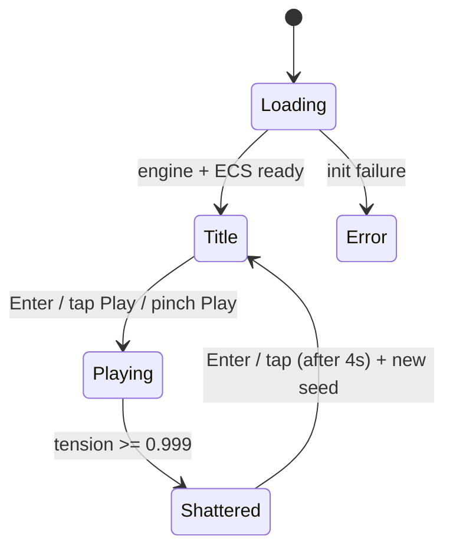
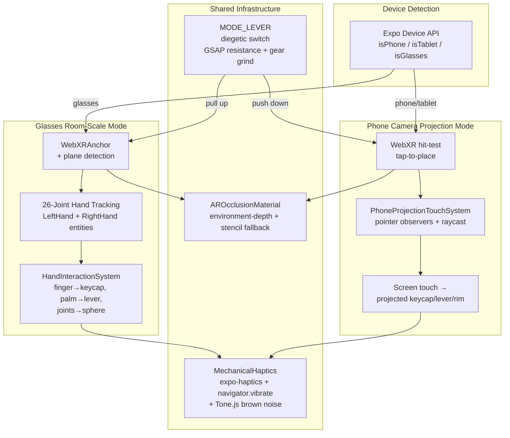

# Design Document — Cognitive Dissonance v3.0

## Overview

Cognitive Dissonance v3.0 transforms the existing v2.0 Next.js web-only game into a cross-platform (web + Android + iOS) experience built on Reactylon Native + Babylon.js 8 (tree-shakable). The architecture elevates Miniplex ECS as the core entity management system, introduces dual AR/MR play modes (glasses room-scale and phone camera projection), WebGPU rendering on web with Babylon Native on mobile, WGSL shaders, XR hand tracking with haptics, procedural morph-based enemies with 7 Yuka AI traits, and a crystalline-cube boss world-crush sequence.

The design preserves the v2.0 mechanical tragedy aesthetic — fragile glass sphere, heavy industrial platter, garage-door keycaps, GSAP mechanical animations, Tone.js spatial audio, buried seed procedural generation — while extending it to AR/MR with zero HUD and fully diegetic interaction.

Key constraints:
- Build target: < 5 MB gzipped
- React 19, Babylon.js 8 tree-shakable imports only (`@babylonjs/core/MODULE`)
- GSAP retained for all mechanical animations (not replaced by Babylon Animation)
- Miniplex + miniplex-react for ECS (not custom systems)
- Tone.js exclusive audio (Babylon audio engine disabled)
- No HUD ever — everything diegetic
- Buried seed drives all procedural generation

## Architecture

### High-Level Architecture

```mermaid
graph TB
    subgraph "Entry Points"
        WEB["index.web.tsx<br/>(Metro + Expo web + WebGPU)"]
        NATIVE["index.native.tsx<br/>(Metro + Expo SDK 55)"]
    end

    subgraph "App Root"
        APP["CognitiveDissonanceRoot.tsx"]
        ENGINE["EngineInitializer<br/>(WebGPU / Babylon Native)"]
        SCENE["SceneManager"]
    end

    subgraph "ECS Layer (Miniplex)"
        WORLD["World.ts<br/>(consolidated archetypes)"]
        LEVEL["Level Archetypes<br/>PlatterRotation | LeverTension<br/>KeySequence | CrystallineCubeBoss"]
        HAND["Hand Archetypes<br/>LeftHand | RightHand<br/>(26 joints each)"]
        AR_ARCH["AR Archetypes<br/>WorldAnchored | Projected<br/>ARSphere"]
        ENEMY_ARCH["Enemy Archetypes<br/>YukaEnemy (7 traits)<br/>CrystallineCubeBoss"]
    end

    subgraph "Core Systems"
        TENSION["TensionSystem"]
        PATTERN["PatternStabilizationSystem"]
        CORRUPTION["CorruptionTendrilSystem"]
        MECH_ANIM["MechanicalAnimationSystem"]
        ECHO["EchoSystem"]
    end

    subgraph "Enemy Systems"
        MORPH["ProceduralMorphSystem"]
        BOSS["CrystallineCubeBossSystem"]
        YUKA["EnemySystem (Yuka AI)"]
    end

    subgraph "Visual Systems"
        NEBULA["SphereNebulaMaterial<br/>(WGSL + GLSL)"]
        PLATTER_OBJ["MechanicalPlatter"]
        POSTPROCESS["PostProcessCorruption"]
        DIEGETIC["DiegeticCoherenceRing"]
        TITLE["TitleAndGameOverSystem"]
        DEGRADE["MechanicalDegradationSystem"]
    end

    subgraph "XR / AR Systems"
        AR_SESSION["ARSessionManager"]
        XR_MGR["XRManager"]
        HAND_SYS["HandInteractionSystem"]
        PHONE["PhoneProjectionTouchSystem"]
        HAPTICS["MechanicalHaptics"]
        OCCLUSION["AROcclusionMaterial"]
    end

    subgraph "Audio"
        AUDIO_BRIDGE["ImmersionAudioBridge<br/>(Expo + Tone.js)"]
        SPATIAL["SpatialAudioManager"]
    end

    subgraph "State (Zustand)"
        SEED["seed-store"]
        GAME["game-store"]
        INPUT["input-store"]
    end

    subgraph "Adaptive Quality"
        QUALITY["DeviceQuality"]
    end

    WEB --> APP
    NATIVE --> APP
    APP --> ENGINE
    ENGINE --> SCENE
    SCENE --> WORLD

    WORLD --> LEVEL
    WORLD --> HAND
    WORLD --> AR_ARCH
    WORLD --> ENEMY_ARCH

    SCENE --> TENSION
    SCENE --> PATTERN
    SCENE --> CORRUPTION
    SCENE --> MECH_ANIM
    SCENE --> ECHO

    TENSION --> MORPH
    TENSION --> BOSS
    PATTERN --> YUKA

    SCENE --> NEBULA
    SCENE --> PLATTER_OBJ
    SCENE --> POSTPROCESS
    SCENE --> DIEGETIC
    SCENE --> TITLE
    SCENE --> DEGRADE

    SCENE --> AR_SESSION
    AR_SESSION --> XR_MGR
    AR_SESSION --> HAND_SYS
    AR_SESSION --> PHONE
    HAND_SYS --> HAPTICS
    AR_SESSION --> OCCLUSION

    SCENE --> AUDIO_BRIDGE
    AUDIO_BRIDGE --> SPATIAL

    TENSION --> AUDIO_BRIDGE
    TENSION --> POSTPROCESS
    TENSION --> NEBULA
    TENSION --> DEGRADE

    SEED --> WORLD
```



### Platform Strategy

| Platform | Engine | Renderer | Shaders | Audio | Haptics | AR |
|----------|--------|----------|---------|-------|---------|-----|
| Web (Chrome 113+) | WebGPUEngine | WebGPU | WGSL primary | Tone.js | navigator.vibrate | WebXR immersive-ar |
| Web (fallback) | Engine (WebGL2) | WebGL2 | GLSL fallback | Tone.js | navigator.vibrate | WebXR immersive-ar |
| iOS (iPhone 12+) | Babylon Native | Metal | WGSL→MSL | expo-audio + Tone.js | expo-haptics | ARKit |
| Android (SD888+) | Babylon Native | Vulkan | WGSL→SPIR-V | expo-audio + Tone.js | expo-haptics | ARCore |

### Build Pipeline

```
Web:    Metro → Expo web → babel-plugin-reactylon → esnext bundle
Native: Metro → Expo SDK 55 dev-client → Reactylon Native → Babylon Native
Shared: TypeScript 5.9 strict, @babylonjs/core subpath imports, tree-shaking
```


## Setup and Scaffolding Procedure

### Compatibility Gap

The Reactylon Native CLI (`create-reactylon-app` v1.2.4) generates projects targeting React Native 0.74.2 + React 18, while Expo SDK 55 targets React Native 0.83.1 + React 19.2.0. The official `@babylonjs/react-native` package only supports up to RN 0.73 — but that's a separate project from Reactylon Native, which uses Babylon Native directly with its own reconciler.

Because of this version mismatch, the v3.0 project uses a **hybrid approach**: Expo SDK 55 as the base, with Reactylon manually integrated on top.

### Project Initialization Commands

```bash
# 1. Create Expo SDK 55 project as the base
pnpm create expo-app cognitive-dissonance --template default@next

# 2. Enter project directory
cd cognitive-dissonance

# 3. Install Reactylon and Babylon.js (tree-shakable subpath imports only)
pnpm add reactylon babel-plugin-reactylon
pnpm add @babylonjs/core @babylonjs/havok

# 4. Install remaining core dependencies
pnpm add miniplex miniplex-react gsap tone zustand yuka seedrandom

# 5. Install Expo native modules
pnpm add expo-haptics expo-speech expo-camera expo-dev-client expo-build-properties

# 6. Install dev dependencies
pnpm add -D typescript @types/react @types/react-native jest ts-jest @types/jest fast-check @biomejs/biome @playwright/test

# 7. Fix any Expo dependency version mismatches
npx expo install --fix

# 8. Generate native projects via Expo prebuild (NOT from Reactylon Native template)
npx expo prebuild --clean
```

### Why Expo Prebuild Instead of Reactylon Native Template

The `npx create-reactylon-app MyApp` command generates a React Native 0.74 project — two major versions behind Expo SDK 55's RN 0.83. Instead:

1. `npx expo prebuild --clean` generates `android/` and `ios/` directories from the Expo SDK 55 template, ensuring RN 0.83 + React 19 compatibility
2. Babylon Native packages are integrated manually into the prebuild output
3. The Reactylon reconciler (`babel-plugin-reactylon`) works at the Babel transform level and is version-agnostic — it doesn't care about the RN version
4. This approach gives us Expo SDK 55's New Architecture (mandatory in SDK 55, `newArchEnabled` removed from app.json) while still using Reactylon's declarative JSX for lights/camera

### Metro Configuration (Expo + Reactylon Native)

```javascript
// metro.config.js
const { getDefaultConfig } = require('expo/metro-config');

const config = getDefaultConfig(__dirname);

// Extend resolver for Reactylon Native + Babylon.js subpath imports
config.resolver.sourceExts = [...config.resolver.sourceExts, 'glsl', 'wgsl'];

module.exports = config;
```

### Babel Configuration (Expo + Reactylon)

```javascript
// babel.config.js
module.exports = function (api) {
  api.cache(true);
  return {
    presets: ['babel-preset-expo'],
    plugins: ['babel-plugin-reactylon'],
  };
};
```

Note: `babel-preset-expo` replaces `metro-react-native-babel-preset` when using Expo SDK 55. The `babel-plugin-reactylon` performs static analysis on JSX elements and auto-handles imports/registrations of Babylon.js classes for tree-shaking.

### Key Expo SDK 55 Commands

```bash
npx expo start                    # Start Metro dev server (all platforms)
npx expo start --web              # Start web dev server
npx expo run:ios                  # Build and run iOS (requires Xcode)
npx expo run:android              # Build and run Android (requires Android Studio)
npx expo export -p web            # Production web export
npx expo prebuild --clean         # Regenerate native projects
npx expo install --fix            # Fix dependency version mismatches
```

### Expo SDK 55 Key Changes

- **New Architecture only** — Legacy Architecture support dropped entirely; `newArchEnabled` removed from app.json
- **New `/src` folder structure** — app code in `/src/app` instead of `/app` (but we override entry points with `index.web.tsx` and `index.native.tsx`)
- **pnpm supported** — `node-linker: hoisted` set automatically by `create-expo-app`
- **Hermes V1** — available experimentally via `useHermesV1` in `expo-build-properties`
- **React 19.2.0** — ships with Expo SDK 55
- **React Native 0.83.1** — ships with Expo SDK 55

### WebXR Caveat

For WebXR sessions, the Reactylon Engine component must use `forceWebGL={true}` — WebXR does not work with WebGPU yet. Reactylon web (v3.5.0+) has WebGPU support enabled by default and falls back to WebGL automatically, but XR sessions require the explicit WebGL flag.


## Components and Interfaces

### Entry Points

**index.web.tsx** — Web entry using `createRoot` from `react-dom/client`. Renders `<App />` into `#root`.

**index.native.tsx** — Native entry using `AppRegistry.registerComponent`. Registers `CognitiveDissonance` component.

**App.tsx** — Root component wrapping `<StrictMode>` → `<EngineInitializer>` → `<SceneManager>` → `<CognitiveDissonanceRoot>`.

### Engine Layer

**EngineInitializer** — Platform-conditional engine creation:
- Web: `WebGPUEngine.IsSupportedAsync()` → `WebGPUEngine` (with `initAsync`) or `Engine` (WebGL2 fallback)
- Native: Reactylon Native backend (Babylon Native Metal/Vulkan)
- Sets hardware scaling, stencil buffer, high-performance power preference

**SceneManager** — Creates Scene with black clear color, right-handed coordinate system. Provides scene context to children.

**PlatformConfig** — Exports `isWeb` and `isNative` booleans from `Platform.OS`.

**DeviceQuality** — Detects device tier (low/mid/high) from `navigator.deviceMemory` and UA heuristics. Applies particle caps, shader LOD, post-process intensity to scene.

### ECS Layer (Miniplex)

**World.ts** — Single consolidated Miniplex World with all archetype definitions. Levels ARE archetypes — each Dream is a Miniplex entity with archetype-specific components. All procedural parameters are built directly into ECS component data at spawn time via seed-derived helper functions.

Source: ARCH v3.1 (Miniplex elevated as authoritative ECS), v3.4 (consolidated world).

```typescript
import { World } from 'miniplex';

export const world = new World<GameEntity>();

// Level Archetypes — each IS a level type, not a JSON definition
// Buried seed selects one per Dream via seedHash % 4
export const PlatterRotationDream = world.archetype(
  'level', 'platterCore', 'rotationAxis', 'tensionCurve', 'keyPatterns', 'buriedSeedHash'
);
export const LeverTensionDream = world.archetype(
  'level', 'leverCore', 'resistanceProfile', 'slitAnimation', 'corruptionTendrilSpawn'
);
export const KeySequenceDream = world.archetype(
  'level', 'keycapPatterns', 'stabilizationHoldTime', 'yukaSpawnRate', 'patternProgression'
);
export const CrystallineCubeBossDream = world.archetype(
  'level', 'boss', 'cubeCrystalline', 'platterLockPhase', 'finalTensionBurst'
);

// Hand Archetypes (XR hand tracking — 26 joints each)
export const LeftHand = world.archetype(
  'xrHand', 'left', 'joints', 'gripStrength', 'pinchStrength', 'contactPoints'
);
export const RightHand = world.archetype(
  'xrHand', 'right', 'joints', 'gripStrength', 'pinchStrength', 'contactPoints'
);

// AR Archetypes (dual mode)
export const WorldAnchoredPlatter = world.archetype(
  'arAnchored', 'platterCore', 'anchor', 'modeLeverPosition', 'roomScale'
);
export const ProjectedPlatter = world.archetype(
  'arAnchored', 'platterCore', 'anchor', 'modeLeverPosition', 'phoneProjected'
);
export const ARSphere = world.archetype('arEntity', 'sphereCore', 'anchor');

// Enemy Archetypes
export const YukaEnemy = world.archetype(
  'enemy', 'yuka', 'morphTarget', 'currentTrait', 'morphProgress', 'anchor'
);
export const CrystallineCubeBoss = world.archetype(
  'boss', 'crystallineCube', 'crushPhase', 'health', 'worldImpact'
);
```

**spawnDreamFromSeed(seedHash)** — Creates a Level_Archetype entity with ALL seed-derived component values built inline. No external JSON files — every procedural parameter is computed from the buried seed PRNG and written directly as ECS component data:

```typescript
export function spawnDreamFromSeed(seedHash: number) {
  const archetypeIndex = seedHash % 4;
  const rng = mulberry32(seedHash);
  const entity: Partial<GameEntity> = { level: true, buriedSeedHash: seedHash };

  // Common seed-derived parameters for ALL archetypes
  const phases = buildPhaseDefinitions(seedHash);
  const difficultyConfig = deriveDifficultyConfig(seedHash);
  const patternSequences = derivePatternSequences(seedHash);
  const audioParams = deriveAudioParams(seedHash);

  switch (archetypeIndex) {
    case 0: // PlatterRotationDream
      Object.assign(entity, {
        platterCore: true, rotationAxis: true,
        tensionCurve: buildTensionCurve(seedHash, 'PlatterRotation'),
        keyPatterns: patternSequences,
        phases, difficultyConfig, audioParams,
        rotationRPM: 2 + (rng() % 7),  // seed-derived 2–8 RPM
        reachZoneArc: Math.PI / 2,       // 90° arc
      });
      break;
    case 1: // LeverTensionDream
      Object.assign(entity, {
        leverCore: true,
        tensionCurve: buildTensionCurve(seedHash, 'LeverTension'),
        keyPatterns: patternSequences,
        phases, difficultyConfig, audioParams,
        resistanceProfile: deriveResistanceProfile(seedHash),
        slitAnimation: true,
        slitPeriod: 1.5 + (rng() % 6) * 0.5,  // seed-derived 1.5–4s
        frequencyTolerance: 0.15,                // base ±0.15
        corruptionTendrilSpawn: 0.8 + (rng() % 5) * 0.1,
      });
      break;
    case 2: // KeySequenceDream
      Object.assign(entity, {
        tensionCurve: buildTensionCurve(seedHash, 'KeySequence'),
        keyPatterns: patternSequences,
        phases, difficultyConfig, audioParams,
        keycapPatterns: deriveMultiKeySequences(seedHash),
        stabilizationHoldTime: 800 + (rng() % 13) * 100,  // seed-derived 800–2000ms
        yukaSpawnRate: phases[0].spawnRate,
        patternProgression: derivePatternProgression(seedHash),
        baseSequenceLength: 2 + (rng() % 2),  // seed-derived 2–3 keys
      });
      break;
    case 3: // CrystallineCubeBossDream
      Object.assign(entity, {
        boss: true, cubeCrystalline: true,
        tensionCurve: buildTensionCurve(seedHash, 'CrystallineCubeBoss'),
        keyPatterns: patternSequences,
        phases, difficultyConfig, audioParams,
        platterLockPhase: 0,
        finalTensionBurst: 0.15,
        bossHealth: 1.5,
        slamCycles: 3,
        counterWindowBase: 4.0,  // seconds
      });
      break;
  }

  return world.createEntity(entity as GameEntity);
}
```

### Core Gameplay Systems

**TensionSystem** (singleton)
- `currentTension: number` (0.0–0.999)
- `increase(amount)` / `decrease(amount)` / `setTension(value)`
- Over-stabilization rebound: 2% chance of +0.12 when tension < 0.05
- Propagates to: ImmersionAudioBridge, MechanicalDegradation, ProceduralMorphSystem, SphereNebulaMaterial, PostProcessCorruption, DifficultyScalingSystem

**DifficultyScalingSystem** (singleton)
- Reads tension from TensionSystem and elapsed time from engine clock each frame
- Computes `DifficultySnapshot` via logarithmic model: `baseValue * (1 + k * Math.log1p(tension * timeScale))`
- Writes updated spawnRate, maxEnemyCount, patternComplexity, morphSpeed, bossSpawnThreshold to active Level_Archetype entity
- Feeds `tensionIncreaseModifier` back to TensionSystem (damped by seed-derived 0.7–0.9 coefficient)
- All scaling coefficients (k, timeScale) derived from buried seed with ±20% per-Dream variance

**PatternStabilizationSystem** (singleton)
- Manages active patterns (Set of key names)
- `holdKey(keyName, holdDuration, handGrip)` — retracts tendril, decreases tension
- `checkPatternMatch(currentPattern[])` — grants coherence bonus for full set match
- Physics impostors on keycaps (mass 0.3, restitution 0.1)

**CorruptionTendrilSystem** (singleton)
- SolidParticleSystem with 24 cylinder tendril shapes parented to Sphere
- Spawns tendrils when tension > 0.3, rate proportional to tension
- `retractFromKey(keyName)` — animates tendril retraction, decreases tension by 0.03

**MechanicalAnimationSystem** (singleton)
- GSAP timelines with CustomEase "heavyMechanical"
- `openSlit()` — garage-door top/bottom with staggered timing
- `pullLever(position)` — back.out ease with resistance
- Keycap emergence via MotionPath
- Registers MODE_LEVER callback for AR mode switching

**EchoSystem** (singleton)
- Spawns translucent ghost keycap (alpha 0.4, red-tinted) on missed pattern
- Auto-dispose after 1800 ms
- Increases tension by 0.035, triggers haptic pulse
- One active echo per key maximum

### Enemy Systems

**ProceduralMorphSystem** (singleton)
- GPU vertex morphing via `MorphTargetManager`
- 7 trait-specific morph targets with vertex offset functions:
  - NeonRaymarcher: base neon trails
  - TendrilBinder: stretch tendrils downward (y -= 0.4)
  - PlatterCrusher: flatten + widen (y *= 0.3)
  - GlassShatterer: jagged spikes (x += sin(i) * 0.15)
  - EchoRepeater: self-duplication (up to 3 copies)
  - LeverSnatcher: targets MODE_LEVER
  - SphereCorruptor: sphere-like blob morph
- morphProgress = lerp(0, 1, tension × 1.5)
- Counter: gripStrength × 0.15 reduces morphProgress; dispose at 0

**CrystallineCubeBossSystem** (singleton)
- Spawns at tension ≥ 0.92 or 3 consecutive missed patterns
- 5-phase GSAP timeline: emerge → descend (2.5s) → slam prep (0.8s) → impact (0.4s) → resolve
- Counter phase: health -= totalGripStrength × 0.012/frame
- Success (health ≤ 0): shatter into Yuka shards
- Failure (health > 0.3): permanent platter deformation, tension → 0.999

### Visual Systems

**SphereNebulaMaterial** — Extends PBRMaterial:
- Sub-surface refraction (0.95), zero metallic, near-zero roughness
- Custom WGSL shader (GLSL fallback) for celestial nebula
- Tension-driven: blue (0.1,0.6,1.0) → red (1.0,0.3,0.1)
- Breathing pulse: sin(time × 1.8) × tension × 0.03
- Static jitter above tension 0.7

**MechanicalPlatter** — Factory function creating:
- Cylinder (0.18m × 1.2m), PBR near-black metal
- Torus track (0.8m × 0.04m)
- Garage-door slit (top/bottom boxes)
- MODE_LEVER (0.08 × 0.12 × 0.04m at x=0.55)
- 14 keycap boxes on rim (polar distribution)
- 52cm Sphere with SphereNebulaMaterial, parented to platter

**PostProcessCorruption** — PostProcessRenderPipeline:
- Bloom (weight = tension × 0.8)
- Vignette (weight = tension × 0.6)
- Chromatic aberration (amount = tension × 0.04)

**DiegeticCoherenceRing** — Torus (0.58m × 0.01m, 64 tessellation):
- Emissive PBR, color shifts blue→red with tension
- Scales 1.0 + tension × 0.2

**TitleAndGameOverSystem**:
- "COGNITIVE DISSONANCE" plane on platter rim, GSAP back.out entrance
- "COGNITION SHATTERED" plane on sphere, red static, GSAP yoyo × 3

**MechanicalDegradationSystem** — WebGL2 fallback only:
- PBR normal map crack intensity (up to 0.8)
- Rotation micro-jitter (sin(t/200) × 0.0005)
- Lever resistance creep
- Zero sphere color changes

### XR / AR Systems

**ARSessionManager** (singleton)
- Detects device type via Expo Device API
- Creates WebXR immersive-ar session with hit-test, anchors, hand-tracking features
- Glasses mode: auto-place at gaze + floor, 26-joint hand interaction
- Phone mode: tap-to-place, screen touch input
- MODE_LEVER listener for mode switching

**XRManager** — WebXR session lifecycle:
- `createDefaultXRExperienceAsync` with hand-tracking feature
- Creates Hand_Archetype entities from WebXRHandTracking
- Per-frame joint update loop: grip/pinch calculation, mechanical mapping

**HandInteractionSystem** — Maps hand joints to gameplay:
- Finger joints near keycap → PatternStabilization.holdKey(pinchStrength)
- Palm on lever → MechanicalAnimation.pullLever(gripStrength)
- Joints on sphere → TensionSystem.increase(0.02)
- All contacts → MechanicalHaptics.triggerContact

**PhoneProjectionTouchSystem** — Screen touch → projected geometry:
- Pointer-down/move observers on scene
- Raycast pick to keycap → PatternStabilization.holdKey
- Raycast pick to lever → MechanicalAnimation.pullLever
- Raycast pick to rim → MechanicalAnimation.rotatePlatter

**MechanicalHaptics** (singleton)
- Native: expo-haptics (Heavy/Medium/Light impact styles)
- Web: navigator.vibrate([30×intensity, 10, 50×intensity])
- Tone.js brown noise rumble synced to tension (volume = tension × -18 dB)

**AROcclusionMaterial** — Extends PBRMaterial:
- Binds WebXR environment-depth texture
- Discards fragments where virtualDepth > realDepth + 0.01
- Fallback: stencil buffer + DepthRenderer
- Applied to all virtual meshes

### Audio Systems

**ImmersionAudioBridge** (singleton)
- Tone.js core: reverb (decay 4s, wet 0.6→0.9 with tension)
- Expo SDK 55 expo-audio for native AudioContext bridge
- Tension-driven: calm drone → frantic glitch → shattered collapse

**SpatialAudioManager**
- Event-driven procedural SFX at contact points
- Buried_Seed-derived BPM, swing, sequence patterns
- Spatial positioning tied to pattern/enemy location

### State Layer (Zustand — retained from v2.0)

- **seed-store**: seedString, rng, generateNewSeed, replayLastSeed
- **game-store**: phase (title, playing, shattered), transitions
- **input-store**: keycap pressed states

Note: TensionSystem replaces level-store's tension management. Coherence moves to TensionSystem. Level progression moves to ECS Level_Archetypes.

### Accessibility

**DiegeticAccessibility** (singleton)
- Voice command recognition via expo-speech
- Maps spoken keycap letters to PatternStabilization.holdKey (1200ms, grip 1.0)
- Adaptive haptics: error-level above 0.7, medium 0.4–0.7

### Multiplayer

**SharedDreamsSystem** (singleton)
- Shares AR anchors with peers
- Remote platter with glass-shard overlay
- Shared corruption: +0.01 tension on sync

### Adaptive Quality

**DeviceQuality** — Tier detection and quality configuration (low/mid/high). All seed-derived procedural parameters (phase definitions, tension curves, spawn rates, Yuka counts, boss triggers) are built directly into ECS component data on Level_Archetype entities via `spawnDreamFromSeed` helper functions (`buildPhaseDefinitions`, `buildTensionCurve`, `deriveDifficultyConfig`). No external JSON config files.


## Data Models

### Miniplex Entity Types

```typescript
interface GameEntity {
  // Level archetype tags
  level?: boolean;
  platterCore?: boolean;
  rotationAxis?: boolean;
  tensionCurve?: TensionCurveConfig;
  keyPatterns?: string[];
  buriedSeedHash?: number;
  leverCore?: boolean;
  resistanceProfile?: number[];
  slitAnimation?: boolean;
  slitPeriod?: number;
  frequencyTolerance?: number;
  corruptionTendrilSpawn?: number;
  keycapPatterns?: string[][];
  stabilizationHoldTime?: number;
  yukaSpawnRate?: number;
  patternProgression?: number[];
  baseSequenceLength?: number;
  boss?: boolean;
  cubeCrystalline?: boolean;
  platterLockPhase?: number;
  finalTensionBurst?: number;
  bossHealth?: number;
  slamCycles?: number;
  counterWindowBase?: number;

  // Seed-derived procedural parameters (built inline, no JSON)
  phases?: PhaseConfig[];
  difficultyConfig?: DifficultyConfig;
  audioParams?: AudioParams;
  rotationRPM?: number;
  reachZoneArc?: number;

  // Hand archetype tags
  xrHand?: boolean;
  left?: boolean;
  right?: boolean;
  joints?: HandJoint[];
  gripStrength?: number;
  pinchStrength?: number;
  contactPoints?: Vector3[];

  // AR archetype tags
  arAnchored?: boolean;
  arEntity?: boolean;
  sphereCore?: boolean;
  anchor?: WebXRAnchor;
  modeLeverPosition?: number;  // -1 = project, +1 = anchor
  roomScale?: boolean;
  phoneProjected?: boolean;

  // Enemy archetype tags
  enemy?: boolean;
  yuka?: boolean;
  morphTarget?: number;
  currentTrait?: YukaTrait;
  morphProgress?: number;

  // Boss archetype tags
  crushPhase?: number;  // 0-4 for 5 phases
  health?: number;
  worldImpact?: boolean;

  // Shared
  position?: { x: number; y: number; z: number };
  velocity?: { x: number; y: number; z: number };
}

type YukaTrait =
  | 'NeonRaymarcher'
  | 'TendrilBinder'
  | 'PlatterCrusher'
  | 'GlassShatterer'
  | 'EchoRepeater'
  | 'LeverSnatcher'
  | 'SphereCorruptor';

interface HandJoint {
  joint: WebXRJoint;
  mesh: Mesh;  // glass-shard particle overlay
}
```

### Seed Configuration Schema

All seed-derived parameters are built directly into ECS component data — no external JSON files.

```typescript
/** Phase definition — built into Level_Archetype entity at spawn time */
interface PhaseConfig {
  tension: number;        // threshold to enter this phase
  patternKeys: string[];  // available keycap letters
  spawnRate: number;      // seconds between pattern spawns (seed-derived base)
  yukaCount: number;      // max concurrent Yuka enemies (seed-derived base)
  boss?: string;          // boss type identifier
}

/** Per-archetype tension curve — built into Level_Archetype entity at spawn time */
interface TensionCurveConfig {
  increaseRate: number;              // base tension increase per missed pattern
  decreaseRate: number;              // base tension decrease per successful hold
  overStabilizationThreshold: number; // tension below which rebound risk applies
  reboundProbability: number;        // chance of over-stabilization rebound
  reboundAmount: number;             // tension spike on rebound
}

/** Difficulty scaling parameters — built into Level_Archetype entity at spawn time */
interface DifficultyConfig {
  k: number;              // logarithmic scaling coefficient (seed-derived, ±20% variance)
  timeScale: number;      // time compression factor (seed-derived, ±20% variance)
  dampingCoeff: number;   // tension↔difficulty feedback damping (seed-derived, 0.7–0.9)
  spawnRateBase: number;  // base spawn interval (seed-derived, 1.0–1.4s)
  spawnRateFloor: number; // minimum spawn interval (0.2s)
  maxEnemyBase: number;   // base max enemies (3)
  maxEnemyCeiling: number; // asymptotic max enemies (24)
  morphSpeedBase: number; // base morph multiplier (1.0)
  morphSpeedCeiling: number; // asymptotic morph multiplier (3.0)
  bossThresholdBase: number; // base boss spawn tension (0.92)
  bossThresholdFloor: number; // minimum boss spawn tension (0.6)
}

/** Helper: builds 3 phases with seed-derived variance */
function buildPhaseDefinitions(seedHash: number): PhaseConfig[] {
  const rng = mulberry32(seedHash);
  const variance = () => 0.85 + (rng() % 31) / 100; // ±15%
  return [
    { tension: 0.0, patternKeys: ['Q','W','E','R','T'], spawnRate: 1.2 * variance(), yukaCount: 3 },
    { tension: 0.4, patternKeys: ['A','S','D','F','G','H'], spawnRate: 0.8 * variance(), yukaCount: 8 },
    { tension: 0.8, patternKeys: ['Z','X','C','V','B','N','M'], spawnRate: 0.4 * variance(), yukaCount: 15, boss: 'crystalline-cube' },
  ];
}

/** Helper: builds tension curve for archetype with seed variance */
function buildTensionCurve(seedHash: number, archetype: string): TensionCurveConfig {
  const rng = mulberry32(seedHash);
  const v = () => 0.85 + (rng() % 31) / 100;
  const curves: Record<string, TensionCurveConfig> = {
    PlatterRotation:       { increaseRate: 0.025*v(), decreaseRate: 0.018*v(), overStabilizationThreshold: 0.05, reboundProbability: 0.02, reboundAmount: 0.12 },
    LeverTension:          { increaseRate: 0.030*v(), decreaseRate: 0.022*v(), overStabilizationThreshold: 0.04, reboundProbability: 0.03, reboundAmount: 0.10 },
    KeySequence:           { increaseRate: 0.020*v(), decreaseRate: 0.015*v(), overStabilizationThreshold: 0.06, reboundProbability: 0.02, reboundAmount: 0.14 },
    CrystallineCubeBoss:   { increaseRate: 0.035*v(), decreaseRate: 0.012*v(), overStabilizationThreshold: 0.03, reboundProbability: 0.04, reboundAmount: 0.15 },
  };
  return curves[archetype];
}

/** Helper: builds difficulty scaling config with seed-derived variance */
function deriveDifficultyConfig(seedHash: number): DifficultyConfig {
  const rng = mulberry32(seedHash);
  const variance20 = () => 0.80 + (rng() % 41) / 100; // ±20%
  return {
    k: 0.5 * variance20(),
    timeScale: 0.001 * variance20(),
    dampingCoeff: 0.7 + (rng() % 21) / 100,  // 0.7–0.9
    spawnRateBase: 1.0 + (rng() % 5) / 10,    // 1.0–1.4s
    spawnRateFloor: 0.2,
    maxEnemyBase: 3,
    maxEnemyCeiling: 24,
    morphSpeedBase: 1.0,
    morphSpeedCeiling: 3.0,
    bossThresholdBase: 0.92,
    bossThresholdFloor: 0.6,
  };
}

/** Audio parameters — built into Level_Archetype entity at spawn time */
interface AudioParams {
  bpm: number;       // 60 + (PRNG % 80) → range [60, 139]
  swing: number;     // (PRNG % 30) / 100 → range [0.00, 0.29]
  rootNote: number;  // PRNG % 12 → semitone offset [0, 11]
}

/** Helper: derives audio parameters from seed */
function deriveAudioParams(seedHash: number): AudioParams {
  const rng = mulberry32(seedHash);
  return {
    bpm: 60 + (rng() % 80),
    swing: (rng() % 30) / 100,
    rootNote: rng() % 12,
  };
}

/** Helper: derives resistance profile for LeverTensionDream */
function deriveResistanceProfile(seedHash: number): number[] {
  const rng = mulberry32(seedHash);
  return Array.from({ length: 10 }, () => rng());
}

/** Helper: derives multi-key sequences for KeySequenceDream */
function deriveMultiKeySequences(seedHash: number): string[][] {
  const rng = mulberry32(seedHash);
  const keys = ['Q','W','E','R','T','A','S','D','F','G','H'];
  return Array.from({ length: 8 }, () => {
    const len = 2 + (rng() % 4); // 2–5 keys per sequence
    return Array.from({ length: len }, () => keys[rng() % keys.length]);
  });
}

/** Helper: derives pattern progression for KeySequenceDream */
function derivePatternProgression(seedHash: number): number[] {
  const rng = mulberry32(seedHash);
  return Array.from({ length: 5 }, () => rng());
}
```

### Tension State

```typescript
interface TensionState {
  currentTension: number;     // 0.0 – 0.999
  coherence: number;          // 0 – 100
  peakCoherence: number;      // high water mark
  overStabilizationRisk: number; // accumulated risk
}
```

### AR Session State

```typescript
interface ARSessionState {
  currentMode: 'glasses' | 'phone' | null;
  platterAnchor: WebXRAnchor | null;
  isInXR: boolean;
  handTrackingAvailable: boolean;
}
```

### Device Quality Tiers

```typescript
interface QualityConfig {
  maxParticles: number;       // 800 | 2500 | 5000
  maxMorphTargets: number;    // 4 | 8 | 12
  thinFilmEnabled: boolean;   // false | true | true
  postProcessIntensity: number; // 0.5 | 0.75 | 1.0
  shaderLOD: 'low' | 'mid' | 'high';
}
```

### Production Packaging

```typescript
// app.json schema
interface ExpoConfig {
  name: 'Cognitive Dissonance';
  slug: 'cognitive-dissonance';
  ios: {
    bundleIdentifier: 'arcade.cabinet.cognitivedissonance';
    infoPlist: {
      NSCameraUsageDescription: string;
      NSMicrophoneUsageDescription: string;
      UIRequiredDeviceCapabilities: ['arkit', 'hand-tracking'];
    };
  };
  android: {
    package: 'arcade.cabinet.cognitivedissonance';
    permissions: ['CAMERA', 'RECORD_AUDIO'];
  };
  plugins: ['expo-ar', 'expo-haptics', 'expo-speech', 'expo-dev-client', 'expo-build-properties'];
}
```


## Level Archetype Gameplay Mechanics

The DreamTypeHandler system manages per-archetype gameplay loops. Each Level_Archetype fundamentally changes how the platter/keycap/lever architecture behaves.

### DreamTypeHandler (singleton)

Registered as the last gameplay system in the update loop. Reads the active Level_Archetype entity from the ECS World and delegates per-frame logic to the appropriate handler.

```typescript
interface DreamHandler {
  activate(entity: GameEntity, scene: Scene): void;
  update(dt: number): void;
  dispose(): void;
}
```

### PlatterRotationDream Handler

- Rotates platter mesh around Y-axis at seed-derived RPM (2–8 RPM via `seedHash % 7 + 2`)
- Defines a 90° "reach zone" arc in front of the camera (±45° from camera forward projected onto platter plane)
- `holdKey` calls outside the reach zone are no-ops — PatternStabilizationSystem checks `isInReachZone(keycapWorldPosition)` before processing
- Rotation speed increases logarithmically: `rpm * (1 + Math.log1p(tension * 3))`
- Thematic enemy bias: PlatterCrusher trait weighted 3x in PRNG distribution

### LeverTensionDream Handler

- MODE_LEVER becomes primary input — corruption tendrils target the lever mesh instead of keycaps
- Lever has a continuous resistance position (0.0–1.0) animated via GSAP with `power2.inOut` ease
- Corruption patterns carry a "frequency" value (0.0–1.0); player must match lever position within ±0.1 tolerance
- Garage-door slit opens/closes rhythmically at seed-derived period (`1.5 + (seedHash % 6) * 0.5` seconds)
- Patterns emerge from the slit during open phase only — player must time lever pulls to the slit cycle
- Thematic enemy bias: LeverSnatcher trait weighted 3x

### KeySequenceDream Handler

- Patterns require ordered multi-key sequences (2–5 keys) instead of single holds
- Sequence length = `2 + Math.floor(tension * 3)` (caps at 5)
- Ghost keycap highlights appear on platter rim showing the required sequence order
- Per-key time window: seed-derived `800 + (seedHash % 13) * 100` ms
- Wrong key in sequence resets progress and spawns an Echo
- Full sequence completion grants double coherence bonus (0.18 tension decrease)
- Thematic enemy bias: EchoRepeater trait weighted 3x

### CrystallineCubeBossDream Handler

- Immediate boss encounter — no warmup phase
- Platter locks rotation, all keycaps retract via GSAP reverse
- Unique boss timeline (different from standard boss spawn): longer descend (4s), multiple slam cycles (up to 3)
- Counter requires simultaneous lever + keycap input: lever controls shield angle (GSAP-animated shield plane), keycaps fire stabilization pulses (each held key = one pulse per 200ms reducing boss health by 0.008)
- Boss health starts at 1.5 (vs 1.0 for standard boss spawn)
- Success: boss shatters into 7 Yuka shards (one per trait), tension drops to 0.5
- Failure: permanent platter deformation + tension → 0.999

### Archetype Transition

When `spawnDreamFromSeed` creates a new Level_Archetype entity:
1. DreamTypeHandler calls `currentHandler.dispose()` (cleans up GSAP timelines, removes scene observers)
2. DreamTypeHandler reads new entity's archetype tag
3. DreamTypeHandler instantiates the matching handler and calls `activate(entity, scene)`
4. Tension state is preserved across transitions


## Keyboard Input System

### KeyboardInputSystem (singleton)

Bridges physical keyboard events to the gameplay systems. Disabled when XR or phone projection is active.

```typescript
class KeyboardInputSystem {
  private activeKeys: Map<string, { startTime: number }>;
  private enabled: boolean;

  constructor(scene: Scene) {
    scene.onKeyboardObservable.add((kbInfo) => {
      if (!this.enabled) return;
      if (kbInfo.type === KeyboardEventTypes.KEYDOWN) this.onKeyDown(kbInfo.event);
      if (kbInfo.type === KeyboardEventTypes.KEYUP) this.onKeyUp(kbInfo.event);
    });
  }
}
```

Key mappings:
- Letter keys (A–Z) → `PatternStabilizationSystem.holdKey(key, holdDuration, 1.0)`
- Spacebar → `MechanicalAnimationSystem.pullLever(position)` where position ramps 0→1 over 800ms hold
- Enter → game phase transition (title→playing, shattered→title with new seed)
- Arrow Left/Right → `MechanicalAnimationSystem.rotatePlatter(direction)` (PlatterRotationDream only)
- Supports up to 6 simultaneous key holds via `Map<string, { startTime }>` tracking
- `setEnabled(false)` called by ARSessionManager when XR session starts or PhoneProjectionTouchSystem activates


## System Orchestration

### SystemOrchestrator (singleton)

Manages initialization order, per-frame update order, and disposal order for all game systems.

### Initialization Order

```
1.  EngineInitializer          — Platform engine (WebGPU / WebGL2 / Babylon Native)
2.  SceneManager               — Scene creation, coordinate system
3.  DeviceQuality              — Tier detection, quality config
4.  ECS World                  — Miniplex world creation, archetype registration
5.  MechanicalPlatter          — Platter mesh, keycaps, slit, lever, sphere
6.  SphereNebulaMaterial       — Glass PBR + nebula shader
7.  DiegeticCoherenceRing      — Coherence torus on sphere
8.  TensionSystem              — Tension state singleton
9.  DifficultyScalingSystem    — Logarithmic difficulty computation from tension + time + seed
10. PatternStabilizationSystem — Pattern tracking, keycap hold logic
11. CorruptionTendrilSystem    — SPS tendril management
12. MechanicalAnimationSystem  — GSAP timelines, CustomEase registration
13. EchoSystem                 — Ghost keycap management
14. ProceduralMorphSystem      — MorphTargetManager, trait vertex functions
15. CrystallineCubeBossSystem  — Boss spawn/timeline logic
16. PostProcessCorruption      — Bloom/vignette/chromatic pipeline
17. ImmersionAudioBridge       — Tone.js + expo-audio initialization
18. SpatialAudioManager        — Spatial SFX positioning
19. DreamTypeHandler           — Archetype gameplay handler
20. ARSessionManager           — WebXR / native AR session
21. KeyboardInputSystem        — Keyboard event observers
```

### Per-Frame Update Order

```
1.  KeyboardInputSystem        — Consume input events
2.  PatternStabilizationSystem — Process holds, check matches
3.  DifficultyScalingSystem    — Recompute difficulty from tension + elapsed time
4.  TensionSystem              — Update tension, check thresholds
5.  CorruptionTendrilSystem    — Spawn/retract tendrils
6.  ProceduralMorphSystem      — Update morph progress
7.  CrystallineCubeBossSystem  — Boss phase progression
8.  EchoSystem                 — Echo lifecycle
9.  MechanicalDegradationSystem — WebGL2 fallback visuals
10. PostProcessCorruption      — Update effect weights
11. ImmersionAudioBridge       — Update reverb/score parameters
12. DreamTypeHandler           — Archetype-specific per-frame logic
```

All systems register via `scene.registerBeforeRender(fn)` in initialization order. The SystemOrchestrator holds references to all system instances and provides:
- `initAll(engine, scene)` — sequential async initialization
- `disposeAll()` — reverse-order teardown (KeyboardInputSystem first, EngineInitializer last)


## Game Phase State Machine



### Loading Phase
- Diegetic loading indicator: platter rim glow pulsing (emissive intensity oscillates 0.2–0.8 at 1.5 Hz)
- Engine initialization, ECS world setup, and seed-derived parameter computation run in parallel where possible
- Transition to Title when all systems report ready

### Title Phase
- Platter visible, sphere with calm blue nebula (tension = 0.0)
- "COGNITIVE DISSONANCE" engraving visible on platter rim
- Garage-door slit closed, all keycaps retracted
- Ambient audio: low drone, reverb wet 0.3

### Playing Phase
- Garage-door slit opens (GSAP staggered animation)
- Keycaps emerge via MotionPath
- DreamTypeHandler spawns first Dream from buried seed
- All gameplay systems active

### Shattered Phase
- Sphere fractures into 64 glass-shard SolidParticles
- All enemies freeze (velocity → 0) and fade (alpha → 0 over 800ms)
- Platter stops rotating, keycaps retract (GSAP reverse, 400ms)
- "COGNITION SHATTERED" text appears with GSAP yoyo × 3
- Heavy haptic burst + glass-shatter SFX
- After 4s: restart enabled (new seed generated, transition to Title)

### Error State
- Static HTML fallback: "Your browser does not support WebGL2 or WebGPU"
- No Babylon.js rendering attempted


## Shader Strategy

### GLSL-First Rationale

All custom shaders are authored in GLSL for maximum platform compatibility:

| Platform | Shader Path |
|----------|-------------|
| Web (WebGPU) | GLSL → auto-converted to WGSL by Babylon.js WASM transpiler (2 MB, loaded on demand) |
| Web (WebGL2) | GLSL used directly |
| Native (Babylon Native / bgfx) | GLSL used directly (bgfx compiles to Metal MSL / Vulkan SPIR-V) |

### Shader Registry

All shaders stored as static string literals in `Effect.ShadersStore` (CSP-safe, no eval):

```typescript
// src/shaders/registry.ts
import { Effect } from "@babylonjs/core/Materials/effect";

Effect.ShadersStore["celestialNebulaVertexShader"] = `...`;
Effect.ShadersStore["celestialNebulaFragmentShader"] = `...`;
Effect.ShadersStore["corruptionTendrilVertexShader"] = `...`;
Effect.ShadersStore["corruptionTendrilFragmentShader"] = `...`;
Effect.ShadersStore["arOcclusionFragmentShader"] = `...`;
Effect.ShadersStore["crystallineBossVertexShader"] = `...`;
Effect.ShadersStore["crystallineBossFragmentShader"] = `...`;
Effect.ShadersStore["neonRaymarcherFragmentShader"] = `...`;
```

### Uniform Bindings

All custom shaders share a common uniform interface:

```glsl
uniform float tension;        // 0.0–0.999
uniform float time;           // scene elapsed time
uniform float corruptionLevel; // derived from tension
uniform vec3 baseColor;       // archetype-derived
uniform float deviceQualityLOD; // 0.0 (low) to 1.0 (high)
```

No `.wgsl` files, no custom Metro shader plugins required.


## Babylon Native Integration Architecture

### Custom Bridge Approach

Since `@babylonjs/react-native` only supports RN ≤ 0.73 and Expo SDK 55 uses RN 0.83, the project uses a custom bridge:

```
React Native (RN 0.83 / Expo SDK 55)
  └── BabylonNativeView (custom native module)
        ├── iOS: MTKView → Babylon Native Engine (Metal)
        ├── Android: SurfaceView → Babylon Native Engine (Vulkan/GLES)
        └── JS: exposes engine instance to React component tree
```

### BabylonNativeView Native Module

```typescript
// src/native/BabylonNativeView.tsx
import { requireNativeComponent } from 'react-native';

interface BabylonNativeViewProps {
  onEngineReady: (event: { nativeEvent: { engineId: string } }) => void;
  antialias?: boolean;
  stencil?: boolean;
}

export const BabylonNativeView = requireNativeComponent<BabylonNativeViewProps>(
  'BabylonNativeView'
);
```

The native module (Swift/Kotlin) creates the rendering surface and initializes Babylon Native's bgfx backend. The JS side receives an engine reference and passes it to the shared SceneManager — from that point, 95%+ of game code is identical to web.

### Fallback Strategy

If the custom bridge proves infeasible:
1. Pin React Native to latest version supported by `@babylonjs/react-native`
2. Use Expo prebuild with `expo-build-properties` to manage native deps
3. Accept the older RN version trade-off for native builds only


## AR Integration Architecture

### Web AR (WebXR)

Uses Babylon.js built-in WebXR support — no additional packages:

```typescript
const xr = await scene.createDefaultXRExperienceAsync({
  uiOptions: { sessionMode: 'immersive-ar' },
  optionalFeatures: ['hit-test', 'anchors', 'hand-tracking', 'depth-sensing'],
});
```

Supported in Chrome 113+, Edge, Quest Browser, Safari 18+ (limited).

### Native AR (Custom Modules)

```
iOS:
  ARKit (ARSession + ARWorldTrackingConfiguration)
  → Custom Expo native module (expo-modules-core)
  → Bridges ARFrame camera transform + depth data to Babylon Native

Android:
  ARCore (Session + Config)
  → Custom Expo native module (expo-modules-core)
  → Bridges ARFrame camera pose + depth data to Babylon Native
```

### app.json Plugin Configuration

```json
{
  "plugins": [
    "expo-camera",
    "expo-haptics",
    "expo-speech",
    "expo-dev-client",
    ["expo-build-properties", {
      "ios": { "deploymentTarget": "16.0" },
      "android": { "minSdkVersion": 28, "compileSdkVersion": 34 }
    }]
  ]
}
```

Note: `expo-ar` does not exist as a package. Camera permissions come from `expo-camera`. AR functionality comes from custom native modules wrapping ARKit/ARCore.

### Fallback

If custom AR native modules are too complex for initial implementation:
- Web + Quest: full WebXR AR
- Native builds: screen-mode only (platter in dark void, touch/keyboard input)


## Seed-to-Gameplay Pipeline

### Pipeline Flow

Levels are Miniplex archetypes — not JSON definitions. The buried seed selects which archetype to spawn as an ECS entity. All procedural parameters (spawn rates, hold times, tension curves, difficulty scaling coefficients) are derived directly from the seed PRNG and built into ECS component data on the Level_Archetype entity at spawn time. No external JSON config files. The archetype IS the level.

```
seedString (user input or auto-generated)
  │
  ▼
mulberry32(hashCode(seedString)) → PRNG stream
  │
  ├─► Archetype Selection: seedHash % 4 → Miniplex entity creation
  │     0 = world.createEntity({ level: true, platterCore: true, rotationAxis: true, ... })
  │     1 = world.createEntity({ level: true, leverCore: true, resistanceProfile: [...], ... })
  │     2 = world.createEntity({ level: true, keycapPatterns: [...], stabilizationHoldTime: ..., ... })
  │     3 = world.createEntity({ level: true, boss: true, cubeCrystalline: true, ... })
  │
  ├─► Phase Definitions (built into entity.phases[]):
  │     Phase 0 (tension 0.0): keys [Q,W,E,R,T], spawnRate ~1.2s, yukaCount 3
  │     Phase 1 (tension 0.4): keys [A,S,D,F,G,H], spawnRate ~0.8s, yukaCount 8
  │     Phase 2 (tension 0.8): keys [Z,X,C,V,B,N,M], spawnRate ~0.4s, yukaCount 15, boss
  │     All values ±15% seed variance via buildPhaseDefinitions(seedHash)
  │
  ├─► Tension Curve (built into entity.tensionCurve):
  │     Per-archetype increase/decrease rates, over-stabilization thresholds, rebound params
  │     All values ±15% seed variance via buildTensionCurve(seedHash, archetype)
  │
  ├─► Difficulty Scaling Config (built into entity.difficultyConfig):
  │     k (log coefficient), timeScale, dampingCoeff — all ±20% seed variance
  │     Base/floor/ceiling for: spawnRate, maxEnemy, morphSpeed, bossThreshold
  │     Via deriveDifficultyConfig(seedHash)
  │
  ├─► Archetype-Specific Component Values (injected into entity at spawn):
  │     PlatterRotationDream: RPM = 2 + (seedHash % 7), reach zone arc
  │     LeverTensionDream: slit period = 1.5 + (seedHash % 6) * 0.5, resistance profile
  │     KeySequenceDream: per-key window = 800 + (seedHash % 13) * 100 ms
  │     CrystallineCubeBossDream: boss health = 1.5, slam cycles = 3
  │
  ├─► Pattern Sequences: per phase, consume PRNG to select from phase patternKeys[]
  │     sequence length = 1 (single hold) or 2–5 (KeySequenceDream)
  │
  ├─► Enemy Trait Distribution: PRNG % 7 with archetype bias
  │     PlatterRotationDream → PlatterCrusher 3x weight
  │     LeverTensionDream → LeverSnatcher 3x weight
  │     KeySequenceDream → EchoRepeater 3x weight
  │     CrystallineCubeBossDream → GlassShatterer 3x weight
  │
  ├─► Audio Parameters:
  │     BPM = 60 + (PRNG % 80)         → range [60, 139]
  │     swing = (PRNG % 30) / 100       → range [0.00, 0.29]
  │     rootNote = PRNG % 12            → semitone offset [0, 11]
  │
  └─► Tension Curve Variance: ±15% on spawn rates and hold times
        spawnRate = baseRate * (0.85 + (PRNG % 31) / 100)
        holdTime = baseHold * (0.85 + (PRNG % 31) / 100)
```

### ECS-Native Procedural Parameters

All procedural parameters are built directly into ECS component data on Level_Archetype entities at spawn time via `buildPhaseDefinitions()`, `buildTensionCurve()`, and `deriveDifficultyConfig()`. No external JSON config files exist. See the **Seed Configuration Schema** in Data Models for the full TypeScript interfaces and builder functions.

**Phase definitions** (3 phases per Dream, built into `entity.phases[]`):

| Phase | Tension Threshold | Pattern Keys | Base Spawn Rate | Base Yuka Count | Boss |
|-------|------------------|--------------|-----------------|-----------------|------|
| 0 | 0.0 | Q, W, E, R, T | ~1.2s | 3 | — |
| 1 | 0.4 | A, S, D, F, G, H | ~0.8s | 8 | — |
| 2 | 0.8 | Z, X, C, V, B, N, M | ~0.4s | 15 | crystalline-cube |

All spawn rates and hold times receive ±15% seed-derived variance.

**Tension curves** (per-archetype, built into `entity.tensionCurve`):

| Archetype | Increase Rate | Decrease Rate | Over-Stab Threshold | Rebound Prob | Rebound Amount |
|-----------|--------------|---------------|---------------------|-------------|----------------|
| PlatterRotation | 0.025 | 0.018 | 0.05 | 0.02 | 0.12 |
| LeverTension | 0.030 | 0.022 | 0.04 | 0.03 | 0.10 |
| KeySequence | 0.020 | 0.015 | 0.06 | 0.02 | 0.14 |
| CrystallineCubeBoss | 0.035 | 0.012 | 0.03 | 0.04 | 0.15 |

All rates receive ±15% seed-derived variance.


## Procedural Difficulty Scaling

### Mathematical Model

The DifficultyScalingSystem is a Miniplex ECS system that computes all difficulty parameters from the current tension, elapsed time since Dream start, and the buried seed PRNG stream. It runs once per frame via `scene.registerBeforeRender`.

**Core formula:**
```
scaledValue = baseValue * (1 + k * Math.log1p(tension * timeScale))
```

Where:
- `k` = logarithmic scaling coefficient (seed-derived, base 0.5, ±20% variance per Dream)
- `timeScale` = time compression factor (seed-derived, base 0.001, ±20% variance per Dream)
- `tension` = current TensionSystem value (0.0–0.999)
- `Math.log1p(x)` = `ln(1 + x)`, ensuring smooth behavior near zero and asymptotic growth

The logarithmic curve guarantees:
- Rapid initial difficulty increase when tension first rises
- Progressively slower scaling as difficulty approaches ceiling
- Values asymptotically approach but never reach their limits
- Endless progression with no level cap

### Scaling Parameters

```typescript
class DifficultyScalingSystem {
  private config: DifficultyConfig;  // from entity.difficultyConfig
  private startTime: number;         // engine clock at Dream start

  update(tension: number, elapsedMs: number): DifficultySnapshot {
    const t = tension;
    const timeScale = this.config.timeScale * elapsedMs;
    const k = this.config.k;
    const scale = 1 + k * Math.log1p(t * timeScale);

    return {
      // Spawn rate: decreases (faster spawns) — base ~1.2s → floor 0.2s
      spawnRate: Math.max(
        this.config.spawnRateFloor,
        this.config.spawnRateBase / scale
      ),
      // Max enemies: increases — base 3 → ceiling 24
      maxEnemyCount: Math.min(
        this.config.maxEnemyCeiling,
        Math.floor(this.config.maxEnemyBase * scale)
      ),
      // Pattern complexity: stepped thresholds from log curve
      patternComplexity: Math.min(6, Math.floor(1 + scale)),
      // Morph speed: increases — base 1.0x → ceiling 3.0x
      morphSpeed: Math.min(
        this.config.morphSpeedCeiling,
        this.config.morphSpeedBase * scale
      ),
      // Boss threshold: decreases (earlier bosses) — base 0.92 → floor 0.6
      bossSpawnThreshold: Math.max(
        this.config.bossThresholdFloor,
        this.config.bossThresholdBase / scale
      ),
      // Tension increase rate modifier (feedback loop with damping)
      tensionIncreaseModifier: 1 + (scale - 1) * this.config.dampingCoeff,
    };
  }
}

interface DifficultySnapshot {
  spawnRate: number;
  maxEnemyCount: number;
  patternComplexity: number;
  morphSpeed: number;
  bossSpawnThreshold: number;
  tensionIncreaseModifier: number;
}
```

### Per-Archetype Scaling Extensions

Each Level_Archetype has additional difficulty parameters scaled by the same logarithmic curve:

| Archetype | Parameter | Base | Ceiling/Floor | Direction |
|-----------|-----------|------|---------------|-----------|
| PlatterRotationDream | Rotation RPM | seed 2-8 | 18 RPM | increases |
| LeverTensionDream | Frequency tolerance | seed +/-0.15 | +/-0.04 | tightens |
| KeySequenceDream | Sequence length | seed 2-3 keys | 7 keys | increases |
| KeySequenceDream | Per-key time window | seed 1200-2000ms | 400ms | shrinks |
| CrystallineCubeBossDream | Slam cycles | 1 | 5 | increases |
| CrystallineCubeBossDream | Counter window | 4s | 1.5s | shrinks |

### Tension-Difficulty Feedback Loop

```
                    +------------------------------+
                    |   DifficultyScalingSystem     |
                    |   reads tension + elapsed     |
                    |   computes DifficultySnapshot |
                    +-------------+----------------+
                                  | tensionIncreaseModifier
                                  v
                    +------------------------------+
                    |       TensionSystem           |
                    |   increase *= modifier        |
                    |   (damped by 0.7-0.9 coeff)  |
                    +-------------+----------------+
                                  | updated tension
                                  v
                    +------------------------------+
                    |   DifficultyScalingSystem     |
                    |   next frame reads new tension|
                    +------------------------------+
```

The damping coefficient (seed-derived, 0.7-0.9) prevents runaway escalation. Higher damping = gentler feedback loop. The system is stable because `Math.log1p` grows sublinearly — even with the feedback loop, difficulty converges rather than diverges.

### Seed-Derived Variance

Every Dream gets unique difficulty curves:
- `k` and `timeScale` receive +/-20% variance from the buried seed PRNG
- All base values (spawn rate, enemy count, morph speed, etc.) receive +/-15-25% variance
- Per-archetype extensions (RPM, tolerance, sequence length) receive +/-15% variance
- Two Dreams with different seeds will have measurably different difficulty progressions
- Same seed always produces identical difficulty curve (deterministic)


## Sphere Shatter Sequence

### Timeline (total ~5.6s)

```
t=0ms      tension hits 0.999
           → freeze all gameplay systems (pattern spawning, enemy movement, tendril growth)
           → TensionSystem.freeze()

t=200ms    sphere mesh fracture begins
           → SolidParticleSystem creates 64 glass-shard particles
           → shards inherit sphere's current nebula color (tension-interpolated red)
           → shard velocities: outward radial + seed-derived angular offset
           → sphere mesh visibility = false

t=200ms    haptic burst
           → expo-haptics: ImpactFeedbackStyle.Heavy
           → navigator.vibrate: [200]
           → Tone.js: white noise burst → highpass(2000Hz) → gain envelope (attack 10ms, decay 400ms)

t=200ms    enemy freeze + fade
           → all YukaEnemy entities: velocity → Vector3.Zero()
           → GSAP tween: alpha 1→0 over 800ms, then dispose

t=200ms    platter shutdown
           → platter rotation speed → 0 (GSAP ease power2.out, 400ms)
           → all keycaps retract via GSAP reverse MotionPath (400ms)

t=600ms    "COGNITION SHATTERED" text appears
           → plane mesh at shatter center point
           → red emissive PBR material
           → GSAP yoyo scaling: scale 0→1.2→1.0, 3 repeats, 600ms each

t=4000ms   restart enabled
           → game-store listens for Enter / tap / pinch
           → on restart: generateNewSeed(), transition to Title phase
```


## Physics Engine Configuration

### Havok Integration

```typescript
import HavokPhysics from "@babylonjs/havok";

const havokInstance = await HavokPhysics();
const havokPlugin = new HavokPlugin(true, havokInstance);
scene.enablePhysics(new Vector3(0, -9.81, 0), havokPlugin);
```

- Fixed timestep: 1/60s (matches render loop target)
- Havok WASM binary: ~1.2 MB (included in bundle size budget)
- Loaded asynchronously during EngineInitializer phase

### Keycap 6DoF Constraints

```typescript
// Per keycap: spring-loaded vertical travel
const constraint = new Physics6DoFConstraint({
  axisA: new Vector3(0, 1, 0),
  axisB: new Vector3(0, 1, 0),
  perpAxisA: new Vector3(1, 0, 0),
  perpAxisB: new Vector3(1, 0, 0),
}, [
  { axis: PhysicsConstraintAxis.LINEAR_Y, minLimit: -0.02, maxLimit: 0 },
], scene);

// Spring parameters
constraint.setAxisMotorType(PhysicsConstraintAxis.LINEAR_Y, PhysicsConstraintMotorType.SPRING);
constraint.setAxisMotorMaxForce(PhysicsConstraintAxis.LINEAR_Y, 1000);
// stiffness 800, damping 40
```

Keycap physics bodies: mass 0.3, restitution 0.1 (from Req 6.5).


## Performance Budget Enforcement

### Bundle Size

- Target: < 5 MB gzipped (web)
- CI check: `gzip -c dist/assets/*.js | wc -c` must be < 5242880 bytes
- Bundle analysis: `rollup-plugin-visualizer` generates treemap HTML on every CI build
- Tree-shaking enforcement: Biome lint rule flags `import { ... } from '@babylonjs/core'` or `import { ... } from 'babylonjs'` — only subpath imports allowed (`@babylonjs/core/Meshes/mesh`, etc.)

### Runtime FPS Monitoring

```typescript
// In DeviceQuality system update loop
const fps = engine.getFps();
if (fps < 30) {
  lowFpsFrames++;
  if (lowFpsFrames > 120) { // 2 seconds at 60fps target
    downgradeQualityTier();
    lowFpsFrames = 0;
  }
} else {
  lowFpsFrames = 0;
}
```

Quality downgrade actions:
- High → Mid: reduce maxParticles 5000→2500, disable thin-film, reduce post-process intensity
- Mid → Low: reduce maxParticles 2500→800, simplify nebula shader, reduce morph targets 8→4

### Havok WASM Budget

Havok WASM binary (~1.2 MB) is part of the 5 MB budget. Loaded async during engine init, not blocking first paint.


## Multiplayer Transport Architecture

### WebRTC DataChannel

```
Player A                          Signaling Server (WS)                    Player B
   │                                      │                                    │
   ├── create offer ──────────────────────►│                                    │
   │                                      ├── forward offer ──────────────────►│
   │                                      │◄── answer ─────────────────────────┤
   │◄── forward answer ──────────────────┤                                    │
   │                                      │                                    │
   │◄═══════════ WebRTC DataChannel (P2P) ═══════════════════════════════════►│
   │                                      │                                    │
   │  anchor sync @ 10 Hz                 │                                    │
   │  tension sync @ 30 Hz                │                                    │
```

### Message Types

```typescript
interface AnchorSyncMessage {
  type: 'anchor';
  position: [number, number, number];
  rotation: [number, number, number, number]; // quaternion
  timestamp: number;
}

interface TensionSyncMessage {
  type: 'tension';
  tension: number;
  coherence: number;
  timestamp: number;
}
```

### Latency Tolerance

- Remote platter position interpolated over 200ms window
- If no message received for 500ms, remote platter fades to alpha 0.3
- If no message for 2000ms, remote platter disposed (peer disconnected)

### Signaling Server

Lightweight WebSocket server (deployable as Cloudflare Worker or AWS Lambda@Edge):
- Room creation via shared seed string (both players enter same seed)
- ICE candidate relay
- No persistent state — stateless relay only

Note: Multiplayer is optional (post-launch) per Req 41.5 and does not block single-player implementation.


## GSAP Plugin Usage

As of GSAP 3.13 (May 2025), all GSAP plugins are 100% free for all use including commercial, sponsored by Webflow. The private npm.greensock.com registry is deprecated.

The project uses:
- **CustomEase** — "heavyMechanical" ease curve for platter/lever/keycap animations
- **MotionPath** — Curved keycap emergence paths from platter interior to rim
- **gsap.to / gsap.timeline** — All mechanical animation sequencing

All imported from the public `gsap` npm package:
```typescript
import gsap from "gsap";
import { CustomEase } from "gsap/CustomEase";
import { MotionPathPlugin } from "gsap/MotionPathPlugin";

gsap.registerPlugin(CustomEase, MotionPathPlugin);
```

No licensing concerns, no fallback implementations needed.


## Grok Doc Code Extraction Plan

The four Grok conversation documents contain production-ready code that must be extracted, not reimplemented from scratch. Each code block below maps to its source document, the version it was finalized in, and its target file in the v3.0 codebase.

### Source Document Index

| Doc | Shorthand | Content |
|-----|-----------|---------|
| `Grok-Cognitive_Dissonance_v3.0_Architecture_Locked.md` | ARCH | Architecture decisions, Miniplex ECS, dual AR/MR, XR hand tracking, morph enemies, boss system, Havok physics |
| `Grok-Cognitive_Dissonance__Reactylon_Native_Migration.md` | MIGRATE | Migration plan, cleanup steps, Reactylon Native template, entry points |
| `Grok-Babylon.js_v8_+_Reactylon_Native_Upgrade_Plan.md` | UPGRADE | Babylon v8 tree-shakable imports, WebGPU, WGSL, React 19, full file refactors |
| `Grok-Procedural_Robot_Bust_Modeling_Breakdown.md` | MASTER | Master doc with extraction manual at tail — NS-5 procedural modeling (Three.js, needs Babylon.js 8 modernization) |

### Extraction Map — Direct Code Blocks

| Target File | Source Doc | Version | Key Content |
|-------------|-----------|---------|-------------|
| `src/ecs/World.ts` | ARCH v3.4 | Consolidated Miniplex world with all archetypes (Level, Hand, AR, Enemy, Boss) + `spawnDreamFromSeed` |
| `src/engine/EngineInitializer.ts` | ARCH v3.0 + UPGRADE | WebGPU detection + WebGL2 fallback + Babylon Native conditional |
| `src/utils/DeviceQuality.ts` | ARCH v3.0 | Tier detection (low/mid/high) from deviceMemory + UA heuristics |
| `src/systems/DifficultyScalingSystem.ts` | ARCH v3.0 | Logarithmic difficulty computation from tension + time + seed-derived DifficultyConfig |
| `src/systems/ImmersionSystem.ts` (→ ImmersionAudioBridge) | ARCH v3.0 + v3.1 | Tone.js core + expo-audio native bridge + tension-driven reverb |
| `src/systems/TensionSystem.ts` | ARCH v3.7 | Full singleton: clamped 0.0–0.999, increase/decrease/set, over-stabilization rebound, propagation to all systems |
| `src/systems/PatternStabilizationSystem.ts` | ARCH v3.7 | Active pattern tracking, holdKey with tendril retraction, coherence bonus, physics impostors |
| `src/systems/CorruptionTendrilSystem.ts` | ARCH v3.7 | SolidParticleSystem with 24 cylinder tendrils, tension-proportional spawn, retractFromKey |
| `src/systems/MechanicalAnimationSystem.ts` | ARCH v3.7 | GSAP timelines + CustomEase, garage-door slit, lever pull, keycap emergence |
| `src/systems/EchoSystem.ts` | ARCH v3.8 | Ghost keycap spawn (alpha 0.4, red-tinted), 1800ms auto-dispose, one-per-key constraint |
| `src/objects/MechanicalPlatter.tsx` | ARCH v3.4 + v4.1 | Full platter factory: cylinder + track + slit + lever + 14 keycaps + sphere, Havok physics aggregates |
| `src/shaders/SphereNebulaMaterial.ts` | ARCH v3.7 | PBR extension with GLSL nebula shader, tension-driven color interpolation, breathing pulse, static jitter |
| `src/ui/DiegeticCoherenceRing.ts` | ARCH v3.7 | Torus mesh, emissive PBR, blue→red with tension, scale 1.0 + tension × 0.2 |
| `src/sequences/TitleAndGameOverSystem.ts` | ARCH v3.7 | "COGNITIVE DISSONANCE" plane on rim (GSAP back.out), "COGNITION SHATTERED" plane on sphere (GSAP yoyo × 3) |
| `src/fallback/MechanicalDegradationSystem.ts` | ARCH v3.1 | PBR normal map cracks, rotation micro-jitter, lever resistance creep, zero sphere color changes |
| `src/enemies/ProceduralMorphSystem.ts` | ARCH v3.6 | MorphTargetManager + GPU vertex morphing, 7 trait vertex offset functions, tension-driven morphProgress, counter mechanic |
| `src/enemies/CrystallineCubeBossSystem.ts` | ARCH v3.5 | Boss spawn conditions, 5-phase GSAP timeline, counter phase, success/failure paths |
| `src/xr/ARSessionManager.ts` | ARCH v3.3 + v3.4 | Dual AR/MR: device detection, glasses room-scale (WebXRAnchor + plane detection), phone projection (hit-test + touch), MODE_LEVER switching |
| `src/xr/XRManager.ts` | ARCH v3.2 | WebXR session lifecycle, hand tracking → Hand_Archetype entities, per-frame joint update |
| `src/xr/HandInteractionSystem.ts` | ARCH v3.2 + v3.3 | 26-joint → keycap/lever/sphere mapping, Miniplex queries on LeftHand/RightHand |
| `src/xr/PhoneProjectionTouchSystem.ts` | ARCH v3.3 | Pointer observers, raycast pick → keycap/lever/rim routing |
| `src/haptics/MechanicalHaptics.ts` | ARCH v3.2 | expo-haptics (Heavy/Medium/Light), navigator.vibrate fallback, Tone.js brown noise rumble synced to tension |
| `src/shaders/AROcclusionMaterial.ts` | ARCH v3.5 | PBR extension with WebXR environment-depth texture, fragment discard, stencil+DepthRenderer fallback, crystalline variant |
| `src/ecs/HandArchetypes.ts` | ARCH v3.2 | LeftHand/RightHand archetypes with 26 joints, gripStrength, pinchStrength, contactPoints |
| `src/ecs/ARArchetypes.ts` | ARCH v3.3 | WorldAnchoredPlatter, ProjectedPlatter, ARSphere archetypes + createARPlatter factory |
| `src/ecs/YukaArchetypes.ts` | ARCH v3.6 | YukaEnemy archetype + YukaTrait type + spawnMorphedYuka factory |
| `src/ecs/BossArchetypes.ts` | ARCH v3.5 | CrystallineCubeBoss archetype + spawnCrystallineCubeBoss factory |
| `src/accessibility/DiegeticAccessibility.ts` | ARCH v3.8 | Voice command via expo-speech, spoken keycap → holdKey, adaptive haptics |
| `src/systems/SharedDreamsSystem.ts` | ARCH v3.8 | AR anchor sharing, remote platter rendering, shared corruption sync |
| `src/postprocess/PostProcessCorruption.ts` | ARCH v3.8 | PostProcessRenderPipeline: bloom/vignette/chromatic, tension-driven weights |
| `src/physics/HavokInitializer.ts` | ARCH v4.1 | HavokPlugin init, gravity, fixed timestep |
| `src/CognitiveDissonanceRoot.tsx` | ARCH v3.4 | Root component: engine init → scene → DeviceQuality → seed → platter → systems → AR → audio → render loop |

### Extraction Map — Modernization Required (MASTER doc)

The MASTER doc (`Grok-Procedural_Robot_Bust_Modeling_Breakdown.md`) contains Three.js procedural modeling code at its tail (extraction manual section). This code informed the v2.0 aesthetic but must be modernized to Babylon.js 8 + Reactylon:

| Legacy Block | Modernization Target | Notes |
|-------------|---------------------|-------|
| NS-5 Sonny bust procedural geometry (Three.js) | Not extracted — replaced by 52cm glass sphere | Bust was de-humanized in v2.0 design decision |
| Cable bundle lofting (Three.js TubeGeometry) | `src/systems/CorruptionTendrilSystem.ts` | Tendril aesthetic derived from cable bundles, now SolidParticleSystem cylinders |
| SDF raymarching shaders (Three.js ShaderMaterial) | `src/shaders/registry.ts` neonRaymarcherFragmentShader | Port GLSL to Babylon.js Effect.ShadersStore, CSP-safe static strings |
| Marching cubes / sculptGeo | Not extracted — replaced by MorphTargetManager | Procedural enemy morphing uses GPU vertex morphing instead |
| GSAP mechanical timelines | `src/systems/MechanicalAnimationSystem.ts` | GSAP code transfers directly — gsap.to works with Babylon Vector3 natively |
| Industrial platter aesthetics | `src/objects/MechanicalPlatter.tsx` | Dimensions, PBR parameters, slit mechanics derived from MASTER doc |

### Extraction Principle

Every code block in the Grok docs that is marked as "full, runnable" or "production-ready" should be extracted as the starting implementation, not rewritten from scratch. The implementation tasks in tasks.md should reference these extractions as their source material. Where the Grok doc code uses patterns that conflict with the design (e.g., barrel imports, wrong React version), the UPGRADE doc provides the modernized versions.


## XR / MR Architecture (Expanded from Grok Docs v3.2–v4.1)

The XR/MR system is the most architecturally complex subsystem. The Grok docs evolved it across 4 versions (v3.2 hand tracking, v3.3 dual AR/MR modes, v3.4 full integration, v3.5 boss + occlusion). This section captures the complete architecture.

### Dual Mode Architecture



### ARSessionManager Flow (from ARCH v3.3)

```
startSession(scene, engine, platter, sphere)
  │
  ├─► Detect device type (Expo Device API)
  │     phone/tablet → mode = 'phone'
  │     glasses/unknown → mode = 'glasses'
  │
  ├─► Create WebXR session
  │     sessionMode: 'immersive-ar'
  │     requiredFeatures: ['hit-test', 'anchors', 'hand-tracking']
  │
  ├─► On IN_XR state:
  │     ├─► placePlatter(mode, scene, platter, sphere)
  │     │     glasses: auto-place at gaze + floor via ray pick
  │     │     phone: register onPointerDown for tap-to-place (one-time)
  │     │
  │     ├─► Create AR archetype entity
  │     │     glasses: WorldAnchoredPlatter { roomScale: true }
  │     │     phone: ProjectedPlatter { phoneProjected: true }
  │     │
  │     ├─► Parent sphere to platter (track constraint)
  │     │
  │     ├─► Activate input system
  │     │     glasses: HandInteractionSystem.activate()
  │     │     phone: PhoneProjectionTouchSystem.activate(scene, xr)
  │     │
  │     └─► Init audio (ImmersionAudioBridge)
  │
  └─► Register MODE_LEVER listener
        lever position > 0 → switchMode('glasses')
        lever position < 0 → switchMode('phone')
        switchMode: detach anchor → re-place → swap input systems
```

### Hand Interaction Mapping (from ARCH v3.2)

The 26-joint hand model maps to gameplay through proximity and grip calculations:

| Hand Region | Joints | Gameplay Mapping | System Call |
|-------------|--------|-----------------|-------------|
| Fingertips (thumb, index, middle) | Tips + DIP joints | Keycap hold when near keycap mesh | `PatternStabilizationSystem.holdKey(keyName, holdDuration, pinchStrength)` |
| Palm + metacarpals | Palm, wrist, metacarpal joints | Lever pull when gripping lever mesh | `MechanicalAnimationSystem.pullLever(gripStrength)` |
| Full hand cradle | All 26 joints surrounding sphere | Sphere tension pulse | `TensionSystem.increase(0.02)` per frame |
| Any contact | Nearest joint to any mesh | Haptic feedback | `MechanicalHaptics.triggerContact(intensity, type)` |

Grip strength = normalized sum of finger curl angles (0.0 = open hand, 1.0 = full fist).
Pinch strength = inverse distance between thumb tip and index tip (0.0 = apart, 1.0 = touching).

### Phone Projection Touch Routing (from ARCH v3.3)

```
onPointerDown / onPointerMove
  │
  ├─► scene.pick(clientX, clientY)
  │
  ├─► pickedMesh.name includes 'keycap' → PatternStabilizationSystem.holdKey(name)
  ├─► pickedMesh.name includes 'lever' → MechanicalAnimationSystem.pullLever(distance)
  ├─► pickedMesh.name includes 'rim' → MechanicalAnimationSystem.rotatePlatter(pickPoint.x)
  └─► pickedMesh = Yuka enemy → counter (reduce morphProgress by touch duration × 0.15)
```

### AR Occlusion Strategy (from ARCH v3.5)

Two-tier approach based on device capability:

| Tier | Devices | Method | Quality |
|------|---------|--------|---------|
| Depth Sensing | iOS 26+, Quest 3+, Vision Pro | WebXR `WebXREnvironmentDepth` feature → depth texture bound to material → fragment discard where `virtualDepth > realDepth + 0.01` | Pixel-perfect |
| Stencil Fallback | All other WebXR devices | Stencil buffer + `DepthRenderer` → manual depth comparison | Approximate, edge artifacts |

Applied to ALL virtual meshes: platter, sphere, keycaps, lever, Yuka enemies, crystalline-cube boss, SolidParticle tendrils, glass-shard particles.

### Havok Physics in XR (from ARCH v4.1)

Hand joints apply real forces to physics bodies:

```
Hand joint position → nearest PhysicsAggregate body
  │
  ├─► gripStrength > 0.3 → applyForce(upward hold force on keycap)
  │     → TensionSystem.decrease(0.012 × gripStrength)
  │
  ├─► palm on lever → HingeConstraint angular motor
  │     → motor force = tension × 120 (resistance increases with corruption)
  │
  └─► joints surrounding sphere → soft spring constraint
        → breathing pulse amplitude modulated by grip proximity
```

### Crystalline-Cube Boss in AR (from ARCH v3.5)

The boss is AR-anchored above the platter and interacts with the real-world plane:

```
Boss spawn (tension ≥ 0.92 OR 3 consecutive misses)
  │
  ├─► Create CrystallineCubeBoss entity + box mesh (0.6m)
  │     material = AROcclusionMaterial(crystalline: true)
  │     position = platter.position + Vector3(0, 1.2, 0)
  │     parent = null (world-anchored, not platter-parented)
  │
  ├─► 5-phase GSAP timeline:
  │     1. Emerge: cube appears above platter
  │     2. Descend: y → platter.y + 0.3 (2.5s, power2.in)
  │     3. Slam prep: scale 1.3x/0.7y/1.3z (0.8s, power4.in)
  │     4. Impact: y → platter.y - 0.1 (0.4s, power4.out)
  │        → MechanicalDegradation.triggerWorldImpact()
  │        → TensionSystem.setTension(0.98)
  │        → MechanicalHaptics.triggerContact(1.0, 'leverPull')
  │     5. Resolve: counter check
  │
  ├─► Counter phase:
  │     health -= totalGripStrength × 0.012 per frame
  │     (glasses: hand grip, phone: touch hold duration)
  │
  ├─► Success (health ≤ 0):
  │     boss shatters into 7 Yuka shards (one per trait)
  │     boss mesh disposed
  │
  └─► Failure (health > 0.3):
        permanent platter deformation (PhysicsAggregate update)
        tension → 0.999 (triggers sphere shatter)
```

### Morph Enemy Traits in AR (from ARCH v3.6)

Each of the 7 Yuka traits has a specific vertex morph shape AND a mechanical-tragedy behavior:

| Trait | Vertex Morph | Behavior | Counter |
|-------|-------------|----------|---------|
| NeonRaymarcher | Base neon trails | Fast movement, evades key holds via quick morph dodge | Sustained grip (3+ seconds) |
| TendrilBinder | Stretch tendrils downward (y -= 0.4) | Extends corruption tendrils to sphere, increases tension 2× faster | Hold matching keycap while gripping enemy |
| PlatterCrusher | Flatten + widen (y *= 0.3) | Heavy morph that flattens keycaps, requires multi-finger hold | Multi-finger hold OR lever counter |
| GlassShatterer | Jagged spikes (x += sin(i) * 0.15) | Fragile high-speed morph, death spawns glass-shard particles that occlude real room | Quick pinch (< 1 second) |
| EchoRepeater | Self-duplication (up to 3 copies) | Duplicates self, each copy AR-anchored independently | Must counter all copies simultaneously |
| LeverSnatcher | Targets MODE_LEVER mesh | Forces unwanted AR mode switch if reaches lever | Pull lever away before enemy reaches it |
| SphereCorruptor | Sphere-like blob morph | Morphs into sphere shape, accelerates breathing corruption | Cradle sphere with both hands to shield |

All enemies use `AROcclusionMaterial` — they are properly occluded by real-world surfaces in AR.
`morphProgress = lerp(0, 1, tension × 1.5)` — enemies morph faster as tension rises.
Counter: `gripStrength × 0.15` reduces morphProgress; dispose at morphProgress ≤ 0.


## Targeted Repository Cleanup

### Files to Delete (remove entirely)

| Path | Reason |
|------|--------|
| `src/app/` (layout.tsx, page.tsx, globals.css) | Next.js App Router — replaced by Metro/Expo entry points |
| `next.config.ts` | Next.js config |
| `next-env.d.ts` | Next.js TypeScript declarations |
| `postcss.config.mjs` | PostCSS for Tailwind — no longer used |
| `index.html` | Legacy web entry — replaced by Expo web entry |
| `index.html.old-canvas` | Dead legacy file |
| `.next/` | Next.js build cache |
| `e2e/` | v2.0 Playwright tests — rewritten for Expo web target |
| `vitest.config.ts` | Vitest config — replaced by Jest |
| `playwright.config.ts` | v2.0 Playwright config — rewritten for Expo web |
| `src/lib/__tests__/` | v2.0 Vitest unit tests — rewritten for Jest |
| `src/store/__tests__/` | v2.0 Vitest store tests — rewritten for Jest |
| `src/components/ui/` | Tailwind/shadcn UI remnants |
| `native/` | Incomplete v2.0 React Native stub |
| `sonar-project.properties` | SonarCloud config for v2.0 |
| `scripts/` | v2.0 utility scripts (icon gen, grok ingest) |

### Files to Replace (delete then recreate with v3.0 implementations)

| Path | Replacement Source |
|------|-------------------|
| `src/components/*.tsx` | v3.0 Grok doc component implementations |
| `src/game/world.ts` | v3.0 Miniplex ECS World with consolidated archetypes |
| `src/lib/*.ts` | v3.0 utility libraries (seedrandom bridge, difficulty helpers) |
| `src/store/*.ts` | v3.0 Zustand stores (seed-store, game-store, input-store) |
| `src/types/*.ts` | v3.0 TypeScript interfaces (GameEntity, PhaseConfig, TensionCurveConfig, DifficultyConfig, etc.) |
| `android/` | Fresh Reactylon Native template (preserving .git/) |
| `ios/` | Fresh Reactylon Native template (preserving .git/) |

### Files to Update (modify in place)

| Path | Changes |
|------|---------|
| `package.json` | Remove Next.js/Vitest/Playwright deps, add Metro/Expo/Jest/Maestro deps, update scripts |
| `tsconfig.json` | Target ES2022, add @babylonjs/core path aliases, remove Next.js paths |
| `babel.config.js` | Add babel-plugin-reactylon, metro-react-native-babel-preset |
| `biome.json` | Update include/exclude patterns for v3.0 file structure |
| `.gitignore` | Add Expo/.expo, Metro/metro-cache, android/build, ios/Pods, *.xcworkspace |
| `.npmrc` | Retain as-is (pnpm config) |
| `.nvmrc` | Update Node version if needed |

### Files to Retain (no changes)

| Path | Reason |
|------|--------|
| `.git/` | Repository history |
| `public/` | Static assets (icons, manifest) — update manifest for v3.0 |
| `screenshots/` | Visual documentation |
| `LICENSE` | Unchanged |
| `CHANGELOG.md` | Append v3.0 entry |


## CI/CD Pipeline Architecture

### CI Workflow (ci.yml) — Pull Requests

```yaml
jobs:
  code-quality:
    # Biome lint, tsc --noEmit, Jest unit tests
    steps:
      - pnpm lint
      - pnpm exec tsc --noEmit
      - pnpm test              # Jest (replaces Vitest)

  web-build:
    needs: [code-quality]
    # Expo web production build + size check
    steps:
      - pnpm build:web
      - "gzip -c dist/assets/*.js | wc -c"  # verify < 5 MB

  android-build:
    needs: [code-quality]
    # Gradle debug APK
    steps:
      - ./gradlew assembleDebug (android/)

  web-e2e:
    needs: [web-build]
    # Playwright E2E against Expo web preview server
    steps:
      - pnpm exec playwright install chromium --with-deps
      - pnpm test:e2e:web

  mobile-e2e:
    needs: [android-build]
    runs-on: macos-latest
    # Maestro flows on Android emulator
    steps:
      - Start Android emulator (API 34)
      - Install debug APK
      - maestro test .maestro/

  ci-success:
    needs: [code-quality, web-build, android-build, web-e2e, mobile-e2e]
```

### CD Workflow (cd.yml) — Main Branch

```yaml
jobs:
  deploy-web:
    # Expo web build → GitHub Pages
    steps:
      - pnpm build:web
      - actions/deploy-pages

  deploy-android:
    # Gradle release APK → GitHub Release artifact
    steps:
      - ./gradlew assembleRelease (android/)
      - Upload APK artifact

  deploy-ios:
    # EAS Build (preview profile) — conditional on EAS credentials
    steps:
      - eas build --platform ios --profile preview
```

### Removed from CI/CD

| Removed | Reason |
|---------|--------|
| Playwright E2E smoke (Next.js) | Replaced by Playwright web E2E (Expo web) + Maestro mobile E2E |
| SonarCloud scan | Replaced by Biome (single binary, zero plugin deps) |
| CodeQL JavaScript analysis | Retained optionally, but Biome covers lint/format |
| Next.js build step | Replaced by Expo web build |
| Next.js static export deploy | Replaced by Expo web export deploy |


## Dependabot Configuration

### v3.0 Package Groups

```yaml
groups:
  # NEW groups for v3.0
  babylonjs:
    patterns:
      - "@babylonjs/*"
  reactylon:
    patterns:
      - "reactylon"
      - "reactylon-native"
  expo:
    patterns:
      - "expo"
      - "expo-*"
  react-native:
    patterns:
      - "react-native"
      - "react-native-*"
  testing:
    patterns:
      - "jest"
      - "ts-jest"
      - "@types/jest"
      - "fast-check"
      - "@playwright/test"
      - "maestro"

  # RETAINED from v2.0
  react:
    patterns:
      - "react"
      - "react-dom"
      - "@types/react"
      - "@types/react-dom"
  dev-tools:
    patterns:
      - "@biomejs/biome"
      - "@types/node"

  # REMOVED from v2.0
  # capacitor (no longer used)
  # build-tools with @vitejs/* (removed — Metro is sole bundler)
  # testing with vitest/playwright/jsdom (replaced by jest/fast-check/playwright/maestro)
```

### GitHub Actions Ecosystem

Retained unchanged — weekly Monday updates, automerge labels.


## Documentation Update Plan

### Files Requiring Full Rewrite

| File | v2.0 Content | v3.0 Content |
|------|-------------|-------------|
| `docs/ARCHITECTURE.md` | Next.js App Router + Turbopack + Reactylon web | Reactylon Native + Metro (all platforms) + Miniplex ECS + dual AR/MR |
| `docs/DEPLOYMENT.md` | Next.js static export + GitHub Pages + Capacitor | Expo web export + EAS Build iOS/Android + Metro dev-client |
| `docs/GITHUB_ACTIONS.md` | Playwright E2E matrix (17 profiles) + Next.js build | Jest + Playwright web E2E + Maestro mobile E2E + Expo/Gradle builds |
| `docs/DESIGN.md` | v2.0 visual elements | v3.0: dual AR/MR, morph enemies, crystalline-cube boss, MODE_LEVER, AR occlusion |
| `docs/DESIGN_SYSTEM.md` | v2.0 materials/shaders | v3.0: WGSL nebula, AR occlusion material, morph enemy materials, boss crystalline |
| `README.md` | Next.js + Turbopack project overview | Cross-platform Reactylon Native + Metro overview |
| `AGENTS.md` | Next.js architecture, Turbopack, Playwright | v3.0 architecture, Metro, Jest/Maestro, ECS, AR/MR |
| `CLAUDE.md` | Next.js conventions | v3.0 conventions and commands |
| `DEVELOPMENT.md` | Next.js dev workflow | Metro dev server (all platforms) + Android Studio/Xcode setup |
| `TESTING.md` | Vitest + Playwright | Jest + fast-check + Playwright web + Maestro mobile |
| `.github/copilot-instructions.md` | Next.js stack | v3.0 stack and conventions |

### Files Requiring Update (not full rewrite)

| File | Changes |
|------|---------|
| `docs/AUTOMATED_WORKFLOWS.md` | Update Dependabot groups, automerge conditions |
| `.gemini/prompts/*.toml` | Update architecture/tooling references |
| `CHANGELOG.md` | Append v3.0 migration entry |


## Test Infrastructure Design

### Unit and Property-Based Testing (Jest + fast-check)

**Runner:** Jest with ts-jest transform

**Configuration (jest.config.ts):**
```typescript
export default {
  preset: 'ts-jest',
  testEnvironment: 'node',
  roots: ['<rootDir>/src'],
  testMatch: ['**/__tests__/**/*.test.ts', '**/*.test.ts'],
  moduleNameMapper: {
    '^@babylonjs/core/(.*)$': '<rootDir>/node_modules/@babylonjs/core/$1',
  },
  collectCoverageFrom: ['src/**/*.ts', '!src/**/*.d.ts', '!src/**/index.ts'],
  coverageReporters: ['lcov', 'text-summary'],
  coverageDirectory: 'coverage',
};
```

**Test Structure:**
```
src/
├── game/
│   ├── world.ts
│   └── __tests__/
│       └── world.test.ts          # ECS archetype creation, seed determinism
├── systems/
│   ├── tension.ts
│   ├── pattern-stabilization.ts
│   ├── corruption-tendril.ts
│   └── __tests__/
│       ├── tension.test.ts         # Unit + PBT: clamping, rebound, propagation
│       ├── pattern-stabilization.test.ts  # Unit + PBT: coherence bonus, hold mechanics
│       └── corruption-tendril.test.ts     # Unit + PBT: spawn rate, retraction
├── store/
│   ├── seed-store.ts
│   ├── game-store.ts
│   └── __tests__/
│       ├── seed-store.test.ts      # Seed generation, replay determinism
│       └── game-store.test.ts      # Phase transitions
└── lib/
    ├── seed-helpers.ts
    └── __tests__/
        └── seed-helpers.test.ts    # Seed pipeline helper functions
```

**Property-Based Test Examples:**

```typescript
// tension.test.ts — TensionSystem properties
import * as fc from 'fast-check';

describe('TensionSystem', () => {
  // Validates: Requirement 5.1
  it('tension is always clamped between 0.0 and 0.999', () => {
    fc.assert(
      fc.property(
        fc.float({ min: -10, max: 10 }),
        fc.float({ min: -10, max: 10 }),
        (initial, delta) => {
          const system = new TensionSystem(clamp(initial, 0, 0.999));
          system.increase(delta);
          expect(system.currentTension).toBeGreaterThanOrEqual(0.0);
          expect(system.currentTension).toBeLessThanOrEqual(0.999);
        }
      )
    );
  });

  // Validates: Requirement 5.4
  it('over-stabilization rebound only triggers below 0.05 tension', () => {
    fc.assert(
      fc.property(
        fc.float({ min: 0.05, max: 0.999 }),
        (tension) => {
          const system = new TensionSystem(tension);
          const before = system.currentTension;
          system.checkOverStabilization();
          // Above 0.05, no rebound should occur
          expect(system.currentTension).toBe(before);
        }
      )
    );
  });
});

// world.test.ts — ECS seed determinism
describe('ECS World', () => {
  // Validates: Requirement 4.6
  it('same seed always produces same Level_Archetype', () => {
    fc.assert(
      fc.property(
        fc.string({ minLength: 1, maxLength: 64 }),
        (seed) => {
          const archetype1 = spawnDreamFromSeed(hashSeed(seed));
          const archetype2 = spawnDreamFromSeed(hashSeed(seed));
          expect(archetype1.type).toBe(archetype2.type);
        }
      )
    );
  });
});
```

### Web E2E Testing (Playwright)

**Configuration (playwright.config.ts):**
```typescript
import { defineConfig } from '@playwright/test';

export default defineConfig({
  testDir: './e2e/web',
  timeout: 30_000,
  retries: 1,
  use: {
    baseURL: 'http://localhost:8081',
    screenshot: 'only-on-failure',
  },
  webServer: {
    command: 'pnpm web',
    port: 8081,
    reuseExistingServer: !process.env.CI,
  },
  projects: [
    { name: 'chromium', use: { browserName: 'chromium' } },
  ],
});
```

**Test Structure:**
```
e2e/
├── web/
│   ├── smoke.spec.ts          # App loads, engine initializes, scene renders
│   ├── gameplay.spec.ts       # Pattern stabilization, tension changes, game over
│   └── helpers/
│       ├── game-helpers.ts    # Shared test utilities
│       └── screenshot-utils.ts
```

### Mobile E2E Testing (Maestro)

**Flow Structure:**
```
.maestro/
├── app-launch.yaml            # App starts, engine initializes, scene renders
├── gameplay-loop.yaml         # Touch keycaps, stabilize patterns, tension decreases
├── ar-session.yaml            # AR session starts (mocked camera), platter anchors
├── game-over.yaml             # Tension reaches max, sphere shatters, game-over screen
└── config.yaml                # Shared Maestro config (app ID, timeouts)
```

**Example Flow (app-launch.yaml):**
```yaml
appId: arcade.cabinet.cognitivedissonance
---
- launchApp
- assertVisible: "Loading"        # Engine initialization indicator
- waitForAnimationToEnd            # Wait for scene setup
- assertVisible:
    id: "game-scene"              # Babylon.js canvas/view accessible
- screenshot: app-launch
```

**Example Flow (gameplay-loop.yaml):**
```yaml
appId: arcade.cabinet.cognitivedissonance
---
- launchApp
- waitForAnimationToEnd
- tapOn:
    id: "keycap-A"                # Touch a keycap
- assertVisible:
    id: "coherence-ring"          # Diegetic GUI responds
- screenshot: gameplay-active
```

### Package.json Test Scripts

```json
{
  "scripts": {
    "test": "jest",
    "test:watch": "jest --watch",
    "test:coverage": "jest --coverage",
    "test:e2e:web": "playwright test",
    "test:e2e:mobile": "maestro test .maestro/",
    "test:e2e:mobile:android": "maestro test .maestro/ --platform android",
    "test:e2e:mobile:ios": "maestro test .maestro/ --platform ios"
  }
}
```

### Migration from v2.0 Test Infrastructure

| v2.0 | v3.0 | Notes |
|------|------|-------|
| Vitest | Jest + ts-jest | vi.fn → jest.fn, vi.spyOn → jest.spyOn, vi.mock → jest.mock |
| @vitest/coverage-v8 | jest --coverage (lcov) | Same lcov output format for CI |
| Playwright (Next.js) | Playwright (Expo web) | webServer command changes, selectors updated |
| — | fast-check | New: property-based testing for core systems |
| — | Maestro | New: mobile E2E for Android/iOS |
| jsdom test env | node test env | Game logic is headless-testable, no DOM needed |


## Correctness Properties

The following properties must hold across the implementation and will be validated via property-based testing with fast-check:

### P1: Tension Clamping Invariant
For any sequence of increase/decrease operations on TensionSystem, currentTension ∈ [0.0, 0.999].
**Validates:** Requirement 5.1

### P2: Over-Stabilization Threshold
Over-stabilization rebound can only trigger when currentTension < 0.05. For any tension ≥ 0.05, checkOverStabilization is a no-op.
**Validates:** Requirement 5.4

### P3: Seed Determinism
For any seed string s, spawnDreamFromSeed(hash(s)) always produces the same Level_Archetype type. The mapping is pure and deterministic.
**Validates:** Requirement 4.6

### P4: Pattern Stabilization Coherence Bonus
When all required keycaps for a pattern set are held simultaneously, tension decreases by exactly 0.09 (the coherence bonus). Partial matches do not trigger the bonus.
**Validates:** Requirement 6.4

### P5: Corruption Tendril Spawn Rate Monotonicity
The tendril spawn rate is monotonically non-decreasing with respect to tension. Higher tension never produces fewer tendrils.
**Validates:** Requirement 7.2

### P6: Echo Uniqueness
At most one active echo exists per keycap at any time. Spawning an echo for a key that already has an active echo is a no-op.
**Validates:** Requirement 20.4

### P7: Device Quality Tier Bounds
For any device tier assignment, maxParticles ≤ 5000, maxMorphTargets ≤ 12, and postProcessIntensity ≤ 1.0. Low tier values are strictly less than mid, which are strictly less than high.
**Validates:** Requirement 3.2, 3.3, 3.4

### P8: Boss Spawn Conditions
CrystallineCubeBoss spawns if and only if tension >= the current bossSpawnThreshold (dynamically scaled by DifficultyScalingSystem, range [0.6, 0.92]) OR consecutiveMissedPatterns >= 3. No other condition triggers a boss spawn.
**Validates:** Requirement 12.1, 43.8

### P9: Seed-to-Archetype Mapping Completeness
For any seedHash value, `seedHash % 4` maps to exactly one of the four Level_Archetypes (0=PlatterRotation, 1=LeverTension, 2=KeySequence, 3=CrystallineCubeBoss). The mapping is total and surjective over the modular range.
**Validates:** Requirement 37.2

### P10: Keyboard Multi-Key Hold Limit
The KeyboardInputSystem tracks at most 6 simultaneous key holds. Pressing a 7th key while 6 are held is a no-op (no crash, no eviction of existing holds).
**Validates:** Requirement 31.3

### P11: System Initialization Order Acyclicity
The SystemOrchestrator initialization order forms a DAG — no system depends on a system initialized after it. Disposal order is the exact reverse of initialization order.
**Validates:** Requirement 32.1, 32.3

### P12: Game Phase Transition Validity
The game-store phase can only transition along valid edges: Loading→Title, Title→Playing, Playing→Shattered, Shattered→Title, Loading→Error. No other transitions are possible.
**Validates:** Requirement 33

### P13: PlatterRotation Reach Zone Invariant
In PlatterRotationDream, holdKey calls for keycaps outside the 90° reach zone have zero effect on tension. Only keycaps within ±45° of camera forward can be stabilized.
**Validates:** Requirement 30.1, 30.2

### P14: Shatter Sequence Ordering
The sphere shatter sequence events occur in strict order: freeze (200ms) → fracture + haptic + enemy fade + platter shutdown (concurrent) → text display (400ms later) → restart enabled (4000ms from start). No event fires out of order.
**Validates:** Requirement 38

### P15: Bundle Size Constraint
The gzipped web production bundle size is strictly less than 5,242,880 bytes (5 MB). This is enforced at CI time.
**Validates:** Requirement 40.1

### P16: Seed Audio Parameter Ranges
For any seed, derived audio parameters are bounded: BPM ∈ [60, 139], swing ∈ [0.00, 0.29], rootNote ∈ [0, 11].
**Validates:** Requirement 37.5

### P17: Seed-to-Entity Component Completeness
*For any* seed string, `spawnDreamFromSeed(hash(s))` produces a Level_Archetype entity with all required component fields populated: `phases[]` (non-empty PhaseConfig array), `tensionCurve` (valid TensionCurveConfig), and `difficultyConfig` (valid DifficultyConfig with all fields within expected ranges). No component field is null or undefined.
**Validates:** Requirement 37.6, 37.7

### P18: Logarithmic Scaling Formula Correctness
*For any* valid DifficultyConfig and any tension ∈ [0.0, 0.999] and elapsedMs >= 0, `DifficultyScalingSystem.update(tension, elapsedMs)` produces a DifficultySnapshot where each field matches the logarithmic formula `baseValue * (1 + k * Math.log1p(tension * timeScale))` (with appropriate min/max clamping per field).
**Validates:** Requirement 43.2, 43.3

### P19: Difficulty Snapshot Bounds Invariant
*For any* DifficultyConfig and any tension/time inputs, all DifficultySnapshot fields are within their specified bounds: spawnRate ∈ [0.2, spawnRateBase], maxEnemyCount ∈ [maxEnemyBase, 24], patternComplexity ∈ [1, 6], morphSpeed ∈ [morphSpeedBase, 3.0], bossSpawnThreshold ∈ [0.6, bossThresholdBase], tensionIncreaseModifier >= 1.0.
**Validates:** Requirement 43.4, 43.5, 43.6, 43.7, 43.8

### P20: Per-Archetype Difficulty Bounds
*For any* archetype-specific difficulty extension and any tension/time inputs, scaled values are within their specified bounds: PlatterRotation RPM ∈ [2, 18], LeverTension tolerance ∈ [0.04, 0.15], KeySequence length ∈ [2, 7], KeySequence time window ∈ [400, 2000], CrystallineCubeBoss slam cycles ∈ [1, 5], CrystallineCubeBoss counter window ∈ [1.5, 4.0].
**Validates:** Requirement 43.9, 43.10, 43.11, 43.12

### P21: Difficulty Feedback Loop Stability
*For any* DifficultyConfig with dampingCoeff ∈ [0.7, 0.9], iterating the tension-difficulty feedback loop (difficulty drives tensionIncreaseModifier, tension drives difficulty) for 10000 frames with a fixed missed-pattern rate converges to a stable equilibrium rather than diverging. The tensionIncreaseModifier remains bounded below `1 + k * Math.log1p(0.999 * timeScale * maxElapsed)`.
**Validates:** Requirement 43.13

### P22: Asymptotic Strict Inequality
*For any* finite tension ∈ [0.0, 0.999] and finite elapsedMs, all scaled difficulty values are strictly within their bounds (never equal to ceiling or floor). Specifically: spawnRate > 0.2, maxEnemyCount < 24, morphSpeed < 3.0, bossSpawnThreshold > 0.6.
**Validates:** Requirement 43.15

### P23: Seed-Derived Difficulty Variance
*For any* two distinct seed strings s1 and s2, the derived DifficultyConfig values (k, timeScale, dampingCoeff) differ with probability > 0.99. Same seed always produces identical DifficultyConfig (deterministic).
**Validates:** Requirement 43.14
